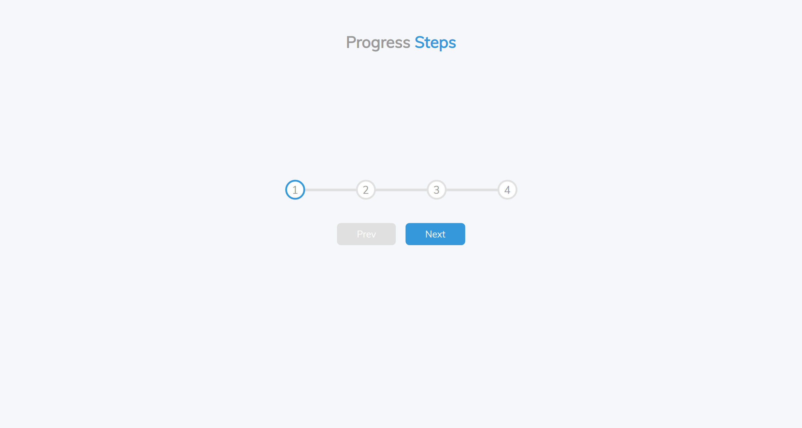
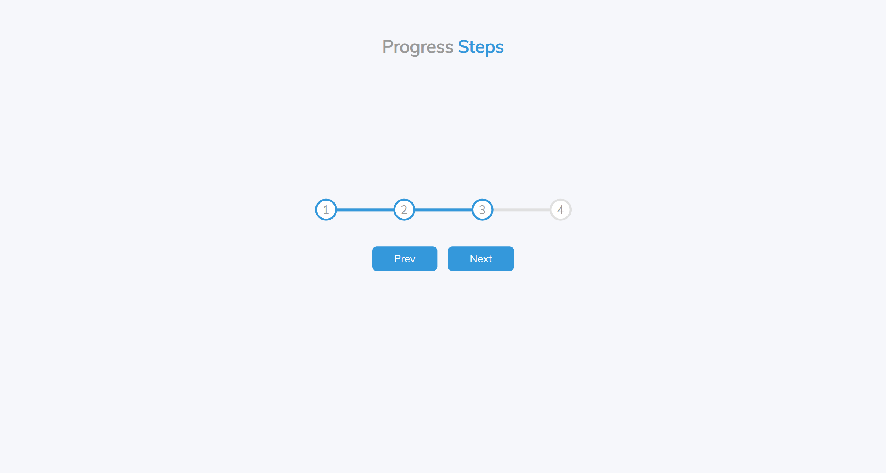
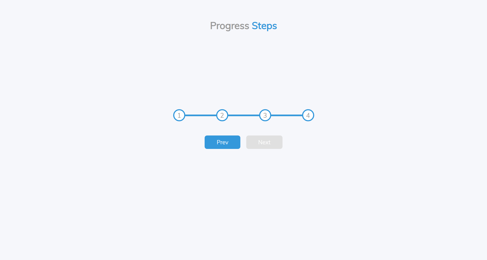

# 50 Projects in 50 Days

## A0. Expanding Cards

This is the solution to the **Progressing Steps** of this "50 Projects in 50 Days" series. In this series you can see different types of projects using different concepts of JavaScript, CSS and HTML.

## Table of contents

- [Overview](#overview)
  - [Snapshots](#snapshots)
  - [Links](#links)
- [My process](#my-process)
  - [Built with](#built-with)
  - [Concepts used](#concepts-used)
  - [Continued development](#continued-development)
  - [Useful resources](#useful-resources)
- [Author](#author)
- [Acknowledgments](#acknowledgments)

## Overview

In this _Progressing Steps_ project, there is a progress bar which have numbers from 1 to 4. There are two buttons, _Prev_ and _Next_.

At initial stage, number _1_ is highlighted with _Prev_ button disabled. As you click on the _Next_ button, number _2_ highlighted and _Prev_ button activated. Same with number _3_. As you reach number _4_, the _Next_ button is disabled.

### Snapshots

Primary Screen :

In-progress :

Complete-progress :

### Links

- Source Code: [Codes](https://github.com/SoniBasant/50-Projects-on-JS-DOM/tree/main/A1.%20Progress%20Steps)
- Live Site URL: [Live link](https://sonibasant.github.io/50-Projects-on-JS-DOM/A1.%20Progress%20Steps/Prog-steps.html)

## My process

### Built with

- Semantic HTML5 markup

- CSS custom properties
- Vanilla JavaScript
- Flexbox
- Desktop-first workflow

### Concepts used

- querySelectorAll()

- forEach()
- addEventListener() > click
- classList.add()
- classList.remove()
- .disabled
- element.length
- if...else

### Continued development

Need to work on design and background.

Your suggestions are welcome. 🙌

### Useful resources

- [Udemy](https://www.udemy.com/course/50-projects-50-days/) - Udemy course on DOM
- [freecodecamp](https://www.freecodecamp.org/) - All the problems I solved. Helped me a lot. 🙌
- [w3schools](https://www.w3schools.com) - This helped me throughout my journey. Still doing. 🙂

## Author

Basant Soni 👨‍💻

- GitHub - [@SoniBasant](https://github.com/SoniBasant)
- Frontend Mentor - [@SoniBasant](https://www.frontendmentor.io/profile/SoniBasant)
- CodePen - [@SoniBasant](https://codepen.io/sonibasant)
- Hashnode - [@SoniBasant](https://sonibasant.hashnode.dev/)

## Acknowledgments

Two people who made this 50 projects series -

- [Brad Traversy](https://github.com/bradtraversy)
- [Florin Pop](https://github.com/florinpop17)
