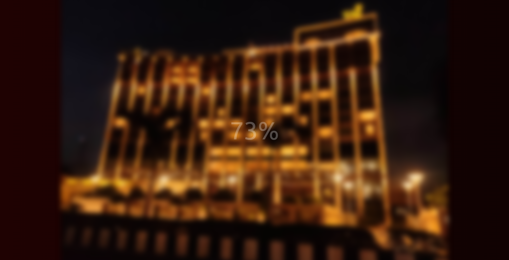

# 50 Projects in 50 Days

## A4. Blurry Loading

This is the solution to the **Blurry Loading** of this "50 Projects in 50 Days" series. In this series you can see different types of projects using different concepts of JavaScript, CSS and HTML.

## Table of contents

- [Overview](#overview)
  - [Snapshots](#snapshots)
  - [Links](#links)
- [My process](#my-process)
  - [Built with](#built-with)
  - [What I learned](#what-i-learned)
  - [Continued development](#continued-development)
  - [Useful resources](#useful-resources)
- [Author](#author)
- [Acknowledgments](#acknowledgments)

## Overview

In this _Blurry Loading_ project, as soon as the page load, you will see the 0% on screen with blurry screen. Within 30ms, the 0% will become 100%. As the percentage increases, it become more transparent till it become completely transparent.

At the same time, Image will start to display from blur to completely visible.

### Snapshots

Disclaimer: ⚠️ Copyright of the image belongs to me.

During loading >

After loading >

### Links

- Solution URL: [Codes](https://github.com/SoniBasant/50-Projects-on-JS-DOM/tree/main/A4.%20Blurry%20Loading)
- Live Site URL: [Live link](https://sonibasant.github.io/50-Projects-on-JS-DOM/A4.%20Blurry%20Loading/blurryLoading.html)

## My process

### Built with

- Semantic HTML5 markup
- CSS custom properties
- Vanilla JavaScript
- Flexbox
- Desktop-first workflow

### What I learned

- setInterval()
- clearInterval()
- style.filter > blur
- style.opacity
- template literals
- querySelector()

And most importantly,

- map a range of numbers to another range of numbers

### Continued development

Your suggestions are welcome. 🙌

### Useful resources

- [Udemy](https://www.udemy.com/course/50-projects-50-days/) - Udemy course on DOM 🤝
- [freecodecamp](https://www.freecodecamp.org/) - All the problems I solved. Helped me a lot. 🙌
- [w3schools](https://www.w3schools.com) - This helped me throughout my journey. Still doing. 🙂
- [stackoverflow](https://stackoverflow.com/) - On changing range of numbers

## Author

Basant Soni 👨‍💻

- GitHub - [@SoniBasant](https://github.com/SoniBasant)
- Frontend Mentor - [@SoniBasant](https://www.frontendmentor.io/profile/SoniBasant)
- CodePen - [@SoniBasant](https://codepen.io/sonibasant)
- Hashnode - [@SoniBasant](https://sonibasant.hashnode.dev/)

## Acknowledgments

Two people who made this 50 projects series -

- [Brad Traversy](https://github.com/bradtraversy)
- [Florin Pop](https://github.com/florinpop17)

The person who answered the question "map a range of numbers to another range of numbers" on stackoverflow

- [August Miller](https://stackoverflow.com/questions/10756313/javascript-jquery-map-a-range-of-numbers-to-another-range-of-numbers)
