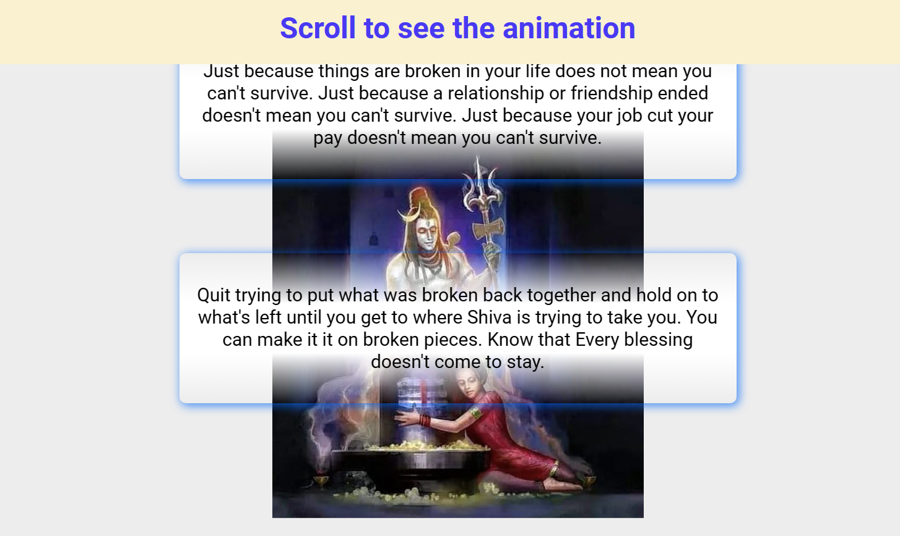

# 50 Projects in 50 Days

## A5. Scroll Animation

This is the solution to the **Scroll Animation** of this "50 Projects in 50 Days" series. In this series you can see different types of projects using different concepts of JavaScript, CSS and HTML.

## Table of contents

- [Overview](#overview)
  - [Snapshots](#snapshots)
  - [Links](#links)
- [My process](#my-process)
  - [Built with](#built-with)
  - [Concepts Used](#concepts-used)
  - [Continued development](#continued-development)
  - [Useful resources](#useful-resources)
- [Author](#author)
- [Acknowledgments](#acknowledgments)

## Overview

In this _Scroll Animation_ project, You open the page and see two quotes with headings "Scroll to see the animation". As you scroll one quote come from right, next from left. And this continues as you keep scrolling.

This is exactly what this project is about,"Scroll Animation".

This project is very good for learning how to measure size of any element from different positions. Also, how to decrease the inner height of screen.

### Snapshots

Disclaimer: ⚠️ Copyright of the image DOES NOT belongs to me.

### Links

- Solution URL: [Codes](https://github.com/SoniBasant/50-Projects-on-JS-DOM/tree/main/A5.%20Scroll%20Animation)
- Live Site URL: [Live link](https://sonibasant.github.io/50-Projects-on-JS-DOM/A5.%20Scroll%20Animation/scroll.html)

## My process

### Built with

- Semantic HTML5 markup
- CSS custom properties
- Vanilla JavaScript
- Flexbox
- Desktop-first workflow

### Concepts used

- window.innerHeight
- addEventListener() > scroll
- querySelectorAll()
- forEach()
- classList.add()
- pseudo class selector
- transform: translateX()

And most **importantly**,

- element.getBoundingClientRect()

### Continued development

Your suggestions are welcome. 🙌

### Useful resources

- [Udemy](https://www.udemy.com/course/50-projects-50-days/) - Udemy course on DOM 🤝
- [freecodecamp](https://www.freecodecamp.org/) - All the problems I solved. Helped me a lot. 🙌
- [w3schools](https://www.w3schools.com) - This helped me throughout my journey. Still doing. 🙂

## Author

Basant Soni 👨‍💻

- GitHub - [@SoniBasant](https://github.com/SoniBasant)
- Frontend Mentor - [@SoniBasant](https://www.frontendmentor.io/profile/SoniBasant)
- CodePen - [@SoniBasant](https://codepen.io/sonibasant)
- Hashnode - [@SoniBasant](https://sonibasant.hashnode.dev/)

## Acknowledgments

Two people who made this 50 projects series -

- [Brad Traversy](https://github.com/bradtraversy)
- [Florin Pop](https://github.com/florinpop17)

Source of these quotes are unknown. I took them from a twitter account [@know_ur_dharma](https://twitter.com/know_ur_dharma). Follow her to read about Sanatan Dharma.
