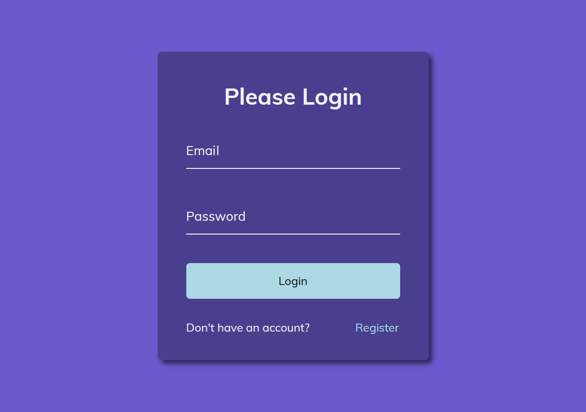

# 50 Projects in 50 Days

## A7. Form Wave Animation

This is the solution to the **Form Wave Animation** of this "50 Projects in 50 Days" series. In this series you can see different types of projects using different concepts of JavaScript, CSS and HTML.

## Table of contents

- [Overview](#overview)
  - [Snapshots](#snapshots)
  - [Links](#links)
- [My process](#my-process)
  - [Built with](#built-with)
  - [Concepts Used](#concepts-used)
  - [Continued development](#continued-development)
  - [Useful resources](#useful-resources)
- [Author](#author)
- [Acknowledgments](#acknowledgments)

## Overview

This _Form Wave Animation_ project is a login form with an interesting twist. As you click on the input area; email or password; the placeholder will move upwards in wavy motion, word by word. After that when you click outside the input area, placeholder will move downwards in the same wavy motion.

Email has HTML5 validation error. That means it will show error if the input doesn't get email in its usual format.

### Snapshots

### Links

- Solution URL: [Codes](https://github.com/SoniBasant/50-Projects-on-JS-DOM/tree/main/A7.%20Form%20Wave%20Animation)
- Live Site URL: [Live link](https://sonibasant.github.io/50-Projects-on-JS-DOM/A7.%20Form%20Wave%20Animation/formWaveAni.html)

## My process

### Built with

- Semantic HTML5 markup
- CSS custom properties
- Vanilla JavaScript
- Flexbox
- Desktop-first workflow

### Concepts used

- querySelectorAll()
- forEach()
- :focus
- :valid
- transition > cubic bezier
- transform > translateY()
- split()
- map()
- join()
- template literals

### Continued development

Local storage can be used to store form data.

Your suggestions are welcome. 🙌

### Useful resources

- [Udemy](https://www.udemy.com/course/50-projects-50-days/) - Udemy course on DOM 🤝
- [freecodecamp](https://www.freecodecamp.org/) - All the problems I solved. Helped me a lot. 🙌
- [w3schools](https://www.w3schools.com) - This helped me throughout my journey. Still doing. 🙂

## Author

Basant Soni 👨‍💻

- GitHub - [@SoniBasant](https://github.com/SoniBasant)
- Frontend Mentor - [@SoniBasant](https://www.frontendmentor.io/profile/SoniBasant)
- CodePen - [@SoniBasant](https://codepen.io/sonibasant)
- Hashnode - [@SoniBasant](https://sonibasant.hashnode.dev/)

## Acknowledgments

Two people who made this 50 projects series -

- [Brad Traversy](https://github.com/bradtraversy)
- [Florin Pop](https://github.com/florinpop17)
