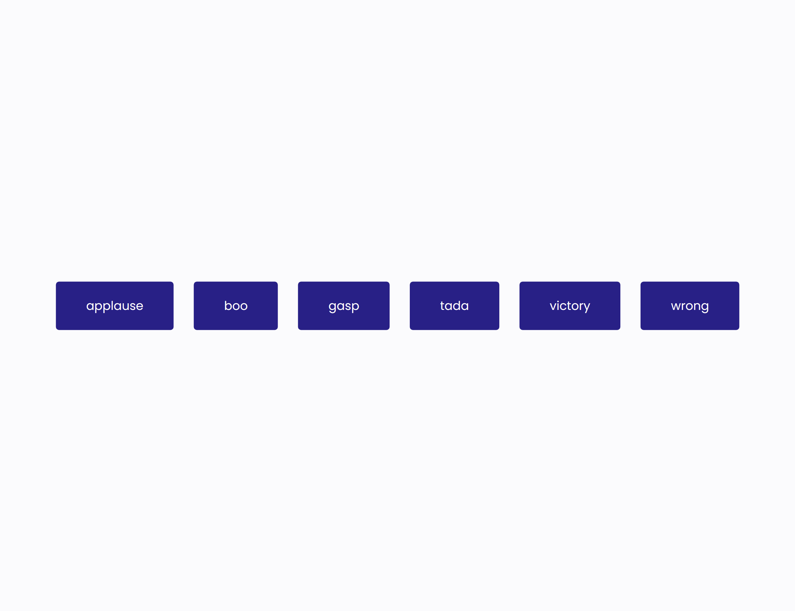

# 50 Projects in 50 Days

## A8. Sound Board

This is the solution to the **Sound Board** of this "50 Projects in 50 Days" series. In this series you can see different types of projects using different concepts of JavaScript, CSS and HTML.

## Table of contents

- [Overview](#overview)
  - [Snapshots](#snapshots)
  - [Links](#links)
- [My process](#my-process)
  - [Built with](#built-with)
  - [Concepts Used](#concepts-used)
  - [Continued development](#continued-development)
  - [Useful resources](#useful-resources)
- [Author](#author)
- [Acknowledgments](#acknowledgments)

## Overview

This _Sound Board_ project is an interesting audio based project in this 50 project series. In this you will see six buttons with names _applause_, _boo_, _gasp_, _tada_, _victory_ and _wrong_. When you press them you will hear different sounds.

Instead of adding buttons through HTML, they are created with JS. Sounds are in different folder titled 'Sounds' and linked to HTML file with src (source) attribute.

### Snapshots

### Links

- Solution URL: [Codes](https://github.com/SoniBasant/50-Projects-on-JS-DOM/tree/main/A8.%20Sound%20Board%20Project)
- Live Site URL: [Live link](https://sonibasant.github.io/50-Projects-on-JS-DOM/A8.%20Sound%20Board%20Project/soundBoard.html)

## My process

### Built with

- Semantic HTML5 markup
- CSS custom properties
- Vanilla JavaScript
- Flexbox
- Desktop-first workflow
- Created, styled and added elements through DOM

### Concepts used

- forEach()
- array
- :focus
- :hover
- :active
- classList.add()
- element.innerText
- addEventListener() > click

Some more **important** concepts -

- document.createElement()
- .play() > HTML5 JS API for sounds
- .pause() > HTML5 JS API for sounds
- appendChild()
- .currentTime

### Continued development

Till sound play, we can see some colours and other graphics.

Need to work on background.

Your suggestions are welcome. 🙌

### Useful resources

- [Udemy](https://www.udemy.com/course/50-projects-50-days/) - Udemy course on DOM 🤝
- [freecodecamp](https://www.freecodecamp.org/) - All the problems I solved. Helped me a lot. 🙌
- [w3schools](https://www.w3schools.com) - This helped me throughout my journey. Still doing. 🙂

## Author

Basant Soni 👨‍💻

- GitHub - [@SoniBasant](https://github.com/SoniBasant)
- Frontend Mentor - [@SoniBasant](https://www.frontendmentor.io/profile/SoniBasant)
- CodePen - [@SoniBasant](https://codepen.io/sonibasant)
- Hashnode - [@SoniBasant](https://sonibasant.hashnode.dev/)

## Acknowledgments

Two people who made this 50 projects series -

- [Brad Traversy](https://github.com/bradtraversy)
- [Florin Pop](https://github.com/florinpop17)
