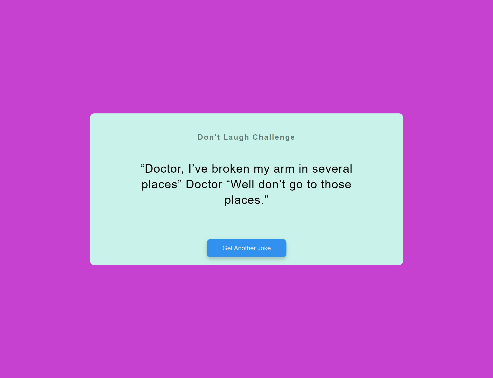

# 50 Projects in 50 Days

## A9. Dad Jokes

This is the solution to the **Dad Jokes** of this "50 Projects in 50 Days" series. In this series you can see different types of projects using different concepts of JavaScript, CSS and HTML.

## Table of contents

- [Overview](#overview)
  - [Snapshots](#snapshots)
  - [Links](#links)
- [My process](#my-process)
  - [Built with](#built-with)
  - [Concepts Used](#concepts-used)
  - [Continued development](#continued-development)
  - [Useful resources](#useful-resources)
- [Author](#author)
- [Acknowledgments](#acknowledgments)

## Overview

This _Dad Jokes_ project is the first API based project out of many in this course. There is an API for dad jokes. We use its data using async with await method. This is very good project to learn about API fetching.

In the page, there is a joke on the display. For the next joke you have to click the button.

### Snapshots

### Links

- Solution URL: [Codes](https://github.com/SoniBasant/50-Projects-on-JS-DOM/tree/main/A9.%20Dad%20Jokes)
- Live Site URL: [Live link](https://sonibasant.github.io/50-Projects-on-JS-DOM/A9.%20Dad%20Jokes/dadJokes.html)

## My process

### Built with

- Semantic HTML5 markup
- CSS custom properties
- Vanilla JavaScript
- Flexbox
- Desktop-first workflow
- Dad joke API

### Concepts used

- getElementById()
- addEventListener() > click
- async > utility module which provides functions for working with asynchronous JS
- headers, accept
- await, fetch
- innerText

### Continued development

Need to work on background.

Your suggestions are welcome. 🙌

### Useful resources

- [Udemy](https://www.udemy.com/course/50-projects-50-days/) - Udemy course on DOM 🤝
- [freecodecamp](https://www.freecodecamp.org/) - All the problems I solved. Helped me a lot. 🙌
- [w3schools](https://www.w3schools.com) - This helped me throughout my journey. Still doing. 🙂

- [Dad joke API](https://icanhazdadjoke.com)

## Author

Basant Soni 👨‍💻

- GitHub - [@SoniBasant](https://github.com/SoniBasant)
- Frontend Mentor - [@SoniBasant](https://www.frontendmentor.io/profile/SoniBasant)
- CodePen - [@SoniBasant](https://codepen.io/sonibasant)
- Hashnode - [@SoniBasant](https://sonibasant.hashnode.dev/)

## Acknowledgments

Two people who made this 50 projects series -

- [Brad Traversy](https://github.com/bradtraversy)
- [Florin Pop](https://github.com/florinpop17)
