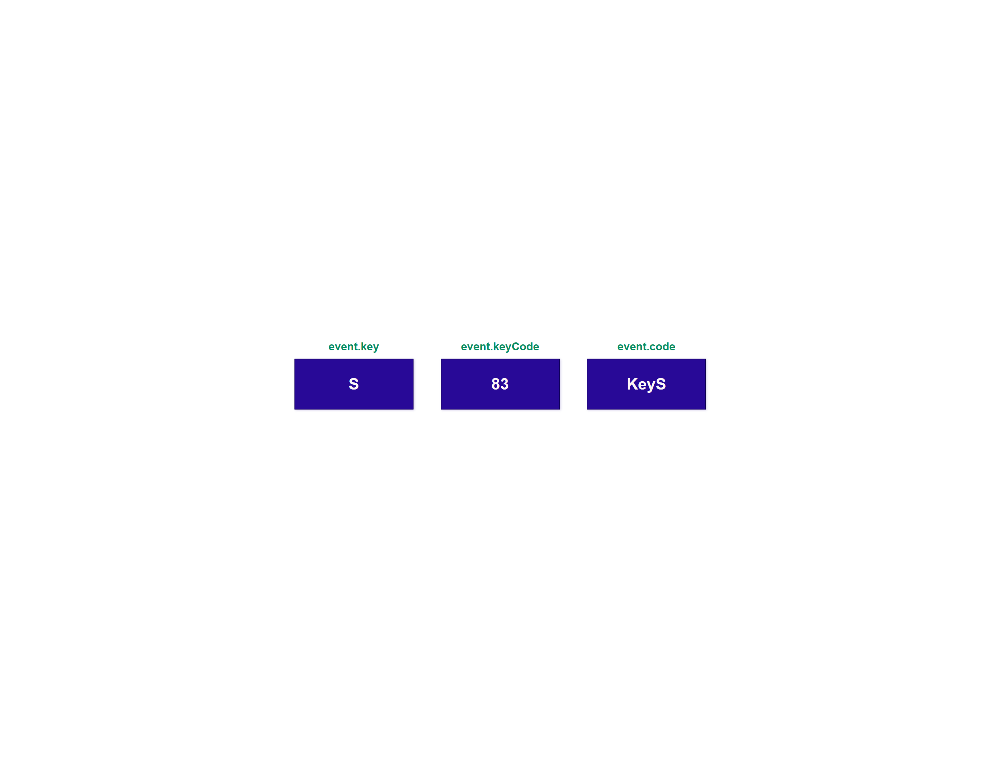
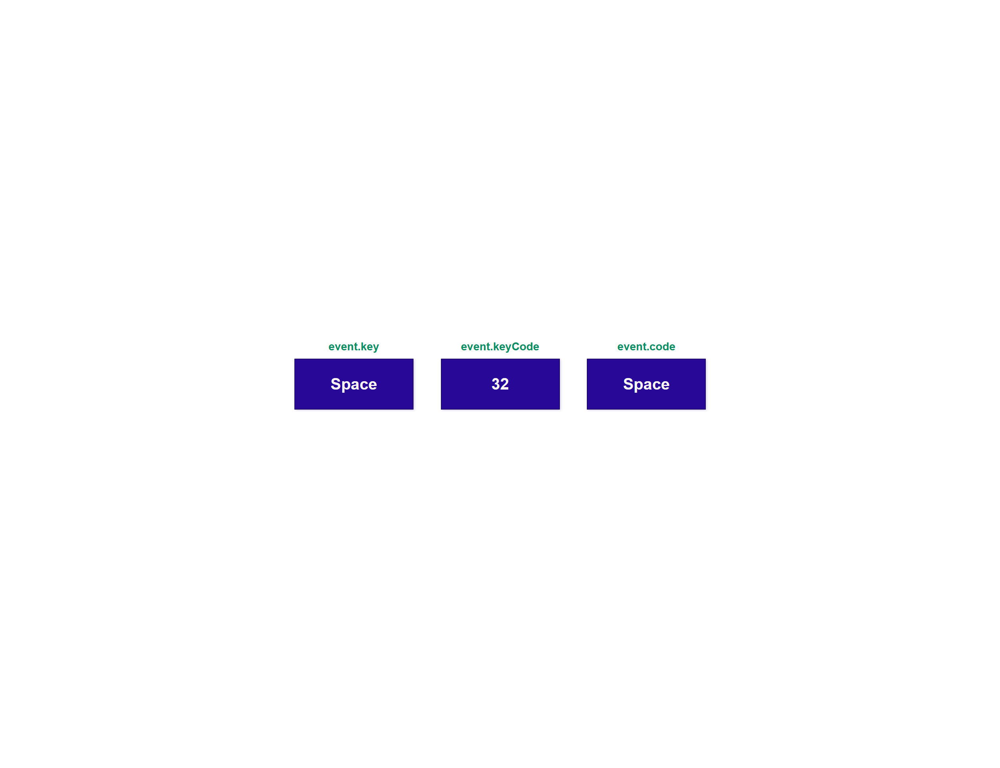

# 50 Projects in 50 Days

## B0. Event Keycodes

This is the solution to the **Event Keycodes** of this "50 Projects in 50 Days" series. In this series you can see different types of projects using different concepts of JavaScript, CSS and HTML.

## Table of contents

- [Overview](#overview)
  - [Snapshots](#snapshots)
  - [Links](#links)
- [My process](#my-process)
  - [Built with](#built-with)
  - [Concepts Used](#concepts-used)
  - [Continued development](#continued-development)
  - [Useful resources](#useful-resources)
- [Author](#author)
- [Acknowledgments](#acknowledgments)

## Overview

To know the keycode and code of any keyboard key, just press that key. This project will show its keycode and code. Generally, we need to get it from console of the browser.

All the keys, except space key, will be displayed accordingly. Space key will show as word "Space".

### Snapshots

Screen as page load >

Screen on clicking any key, here _S_ >

Screen on clicking _Space_ key >

### Links

- Solution URL: [Codes](https://github.com/SoniBasant/50-Projects-on-JS-DOM/tree/main/B0.%20Event%20Keycodes)
- Live Site URL: [Live link](https://sonibasant.github.io/50-Projects-on-JS-DOM/B0.%20Event%20Keycodes/eventKeycodes.html)

## My process

### Built with

- Semantic HTML5 markup
- CSS custom properties
- Vanilla JavaScript
- Flexbox
- Desktop-first workflow

### Concepts used

- getElementById()
- addEventListener() > keydown
- Template literals
- Arrow function
- Ternary operator

And **most importantly**,

- key, keycode and code from _KeyboardEvent_ (Use it from developer tools of browser)

### Continued development

Need to work on background and colour scheme.

Your suggestions are welcome. 🙌

### Useful resources

- [Udemy](https://www.udemy.com/course/50-projects-50-days/) - Udemy course on DOM 🤝
- [freecodecamp](https://www.freecodecamp.org/) - All the problems I solved. Helped me a lot. 🙌
- [w3schools](https://www.w3schools.com) - This helped me throughout my journey. Still doing. 🙂

## Author

Basant Soni 👨‍💻

- GitHub - [@SoniBasant](https://github.com/SoniBasant)
- Frontend Mentor - [@SoniBasant](https://www.frontendmentor.io/profile/SoniBasant)
- CodePen - [@SoniBasant](https://codepen.io/sonibasant)
- Hashnode - [@SoniBasant](https://sonibasant.hashnode.dev/)

## Acknowledgments

Two people who made this 50 projects series -

- [Brad Traversy](https://github.com/bradtraversy)
- [Florin Pop](https://github.com/florinpop17)
