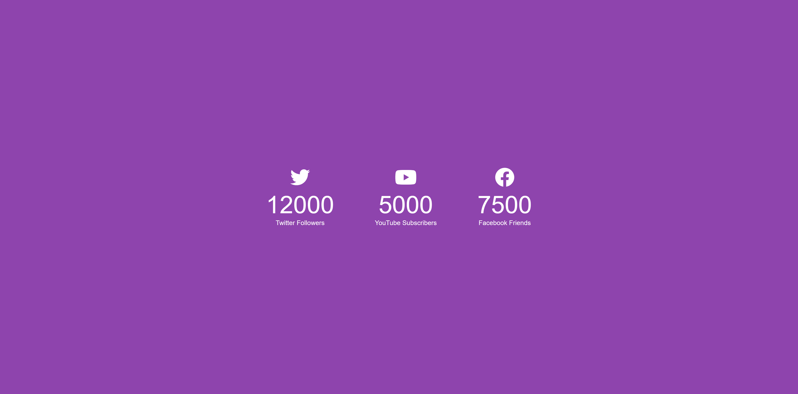

# 50 Projects in 50 Days

## B4. Incrementing Counter

This is the solution to the **Incrementing Counter** of this "50 Projects in 50 Days" series. In this series you can see different types of projects using different concepts of JavaScript, CSS and HTML.

## Table of contents

- [Overview](#overview)
  - [Snapshots](#snapshots)
  - [Links](#links)
- [My process](#my-process)
  - [Built with](#built-with)
  - [Concepts Used](#concepts-used)
  - [Continued development](#continued-development)
  - [Useful resources](#useful-resources)
- [Author](#author)
- [Acknowledgments](#acknowledgments)

## Overview

To show incrementing counter, this _Incrementing Counter_ project have social media followers, subscribers and friends as numbers. As the page load, all NUMBERs starts increasing from ZERO. Though all numbers are different in quantities, they finish at the same time.

### Snapshots

### Links

- Solution URL: [Source Code](https://github.com/SoniBasant/50-Projects-on-JS-DOM/tree/main/B4.%20Incrementing%20Counter)
- Live Site URL: [Live link](https://sonibasant.github.io/50-Projects-on-JS-DOM/B4.%20Incrementing%20Counter/increCounter.html)

## My process

### Built with

- Semantic HTML5 markup
- CSS custom properties
- Vanilla JavaScript
- Flexbox
- Desktop-first workflow

### Concepts used

- getAttribute()
- :root
- querySelectorAll()
- forEach()
- .innerText
- template literal
- Math.ceil()
- setTimeout()
- arrow function
- if...else
- @media query

- data-target attribute in HTML

### Continued development

Need to work on design.

Your suggestions are welcome. 🙌

### Useful resources

- [Udemy](https://www.udemy.com/course/50-projects-50-days/) - Udemy course on DOM 🤝
- [freecodecamp](https://www.freecodecamp.org/) - All the problems I solved. Helped me a lot. 🙌
- [w3schools](https://www.w3schools.com) - This helped me throughout my journey. Still doing. 🙂
- [Google API](https://fonts.googleapis.com/css?family=Roboto+Mono&display=swap) - API for fonts 🆎
- [cdnjs](https://cdnjs.cloudflare.com/ajax/libs/font-awesome/6.2.0/css/all.min.css) - for Icons <>

## Author

Basant Soni 👨‍💻

- GitHub - [@SoniBasant](https://github.com/SoniBasant)
- Frontend Mentor - [@SoniBasant](https://www.frontendmentor.io/profile/SoniBasant)
- CodePen - [@SoniBasant](https://codepen.io/sonibasant)
- Hashnode - [@SoniBasant](https://sonibasant.hashnode.dev/)

## Acknowledgments

Two people who made this 50 projects series -

- [Brad Traversy](https://github.com/bradtraversy)
- [Florin Pop](https://github.com/florinpop17)
