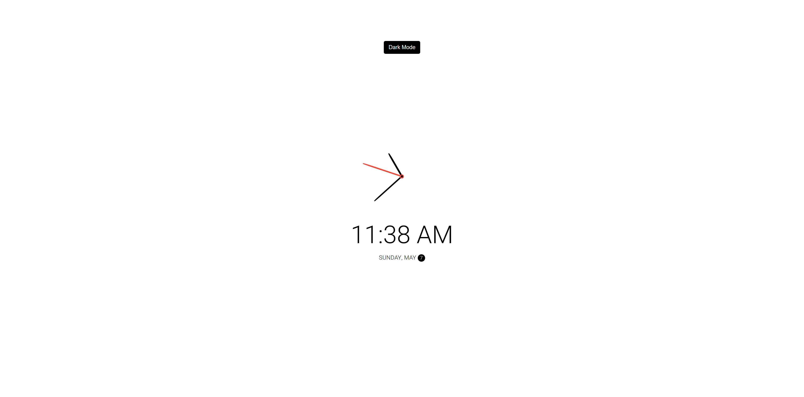
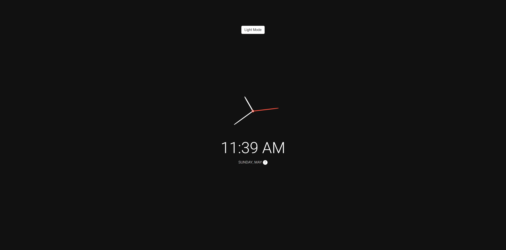

# 50 Projects in 50 Days

## B8. Theme Clock

This is the solution to the **Theme Clock** of this "50 Projects in 50 Days" series. In this series you can see different types of projects using different concepts of JavaScript, CSS and HTML.

## Table of contents

- [Overview](#overview)
  - [Snapshots](#snapshots)
  - [Links](#links)
- [My process](#my-process)
  - [Built with](#built-with)
  - [Concepts Used](#concepts-used)
  - [Continued development](#continued-development)
  - [Useful resources](#useful-resources)
- [Author](#author)
- [Acknowledgments](#acknowledgments)

## Overview

This clock is theme clock because its colours can be changed as per Light Mode or Dark Mode. In our clock, we have an analog clock, a digital clock, AM-PM, day, date and month.

We have a button to change our theme from light mode to dark mode and vice versa. Only in analog clock, second's hand remains same red colour during theme change.

### Snapshots

Clock on load : Light Theme

Clock on color change : Dark Theme

### Links

- Solution URL: [Source Code](https://github.com/SoniBasant/50-Projects-on-JS-DOM/tree/main/B8.%20Theme%20Clock)
- Live Site URL: [Live link](https://sonibasant.github.io/50-Projects-on-JS-DOM/B8.%20Theme%20Clock/themeClock.html)

## My process

### Built with

- Semantic HTML5 markup
- CSS custom properties
- Vanilla JavaScript
- Flexbox
- Desktop-first workflow

### Concepts used

- querySelector()
- array
- classList.add()
- classList.remove()
- classList.contains()
- template literals
- ternary operator
- if..else
- addEventListener() > click
- arrow function
- innerHTML
- element.style.transform
- @import
- :root
- transition, translate

And some **important** concepts,

- Date() to get Date, Day, Month, Hour, Minute, Second
- transform origin,
- map a range of numbers to another range of numers
- setInterval(function, timeMS)

### Continued development

Need to work on design.

Your suggestions are welcome. 🙌

### Useful resources

- [Udemy](https://www.udemy.com/course/50-projects-50-days/) - Udemy course on DOM 🤝
- [freecodecamp](https://www.freecodecamp.org/) - All the problems I solved. Helped me a lot. 🙌
- [w3schools](https://www.w3schools.com) - This helped me throughout my journey. Still doing. 🙂
- [stackoverflow](https://stackoverflow.com/) - On changing range of numbers

## Author

Basant Soni 👨‍💻

- GitHub - [@SoniBasant](https://github.com/SoniBasant)
- Frontend Mentor - [@SoniBasant](https://www.frontendmentor.io/profile/SoniBasant)
- CodePen - [@SoniBasant](https://codepen.io/sonibasant)
- Hashnode - [@SoniBasant](https://sonibasant.hashnode.dev/)

## Acknowledgments

Two people who made this 50 projects series -

- [Brad Traversy](https://github.com/bradtraversy)
- [Florin Pop](https://github.com/florinpop17)

The person who answered the question "map a range of numbers to another range of numbers" on stackoverflow

- [August Miller](https://stackoverflow.com/questions/10756313/javascript-jquery-map-a-range-of-numbers-to-another-range-of-numbers)
