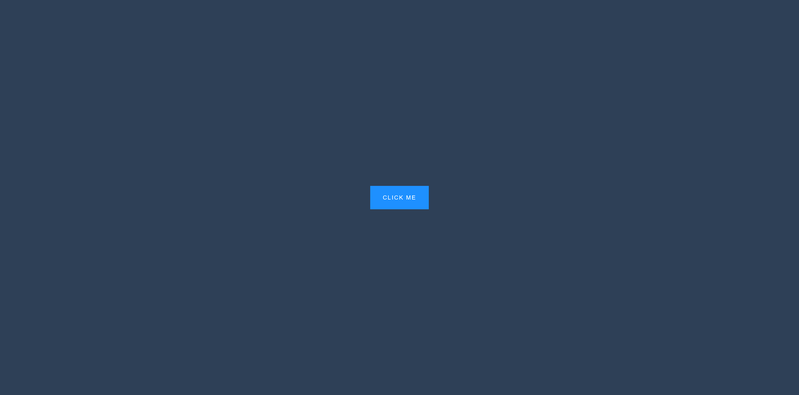

# 50 Projects in 50 Days

## B9. Button Ripple Effect

This is the solution to the **Button Ripple Effect** of this "50 Projects in 50 Days" series. In this series you can see different types of projects using different concepts of JavaScript, CSS and HTML.

## Table of contents

- [Overview](#overview)
  - [Snapshots](#snapshots)
  - [Links](#links)
- [My process](#my-process)
  - [Built with](#built-with)
  - [Concepts Used](#concepts-used)
  - [Continued development](#continued-development)
  - [Useful resources](#useful-resources)
- [Author](#author)
- [Acknowledgments](#acknowledgments)

## Overview

We have a button. When you click on it, a white colour circle will appear at the place of click. Within 0.5s, this circle will expand and disappear, leaving no trace behind. This is button ripple effect.

### Snapshots

### Links

- Solution URL: [Source Code](https://github.com/SoniBasant/50-Projects-on-JS-DOM/tree/main/B9.%20Button%20Ripple%20Effect)
- Live Site URL: [Live link](https://sonibasant.github.io/50-Projects-on-JS-DOM/B9.%20Button%20Ripple%20Effect/btnRippleEffect.html)

## My process

### Built with

- Semantic HTML5 markup
- CSS custom properties
- Vanilla JavaScript
- Flexbox
- Desktop-first workflow

### Concepts used

- querySelectorAll()
- forEach()
- addEventListener() > click
- document.createElement()
- .classList.add() and .classList.remove()
- setTimeout()
- appendChild()
- arrow function
- e.target
- :root
- transform, translate

And some **important** concepts,

- pageX and pageY to get the coordinates relative to element
- .offsetLeft and .offsetTop
- @Keyframes

### Continued development

Need to work on design and background.

Your suggestions are welcome. 🙌

### Useful resources

- [Udemy](https://www.udemy.com/course/50-projects-50-days/) - Udemy course on DOM 🤝
- [freecodecamp](https://www.freecodecamp.org/) - All the problems I solved. Helped me a lot. 🙌
- [w3schools](https://www.w3schools.com) - This helped me throughout my journey. Still doing. 🙂
- [Google API](https://fonts.googleapis.com/css2?family=Roboto:wght@400;700&display=swap) - For font

## Author

Basant Soni 👨‍💻

- GitHub - [@SoniBasant](https://github.com/SoniBasant)
- Frontend Mentor - [@SoniBasant](https://www.frontendmentor.io/profile/SoniBasant)
- CodePen - [@SoniBasant](https://codepen.io/sonibasant)
- Hashnode - [@SoniBasant](https://sonibasant.hashnode.dev/)

## Acknowledgments

Two people who made this 50 projects series -

- [Brad Traversy](https://github.com/bradtraversy)
- [Florin Pop](https://github.com/florinpop17)
