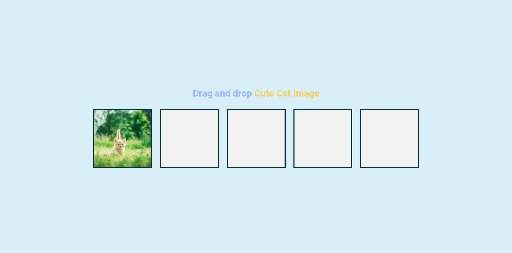
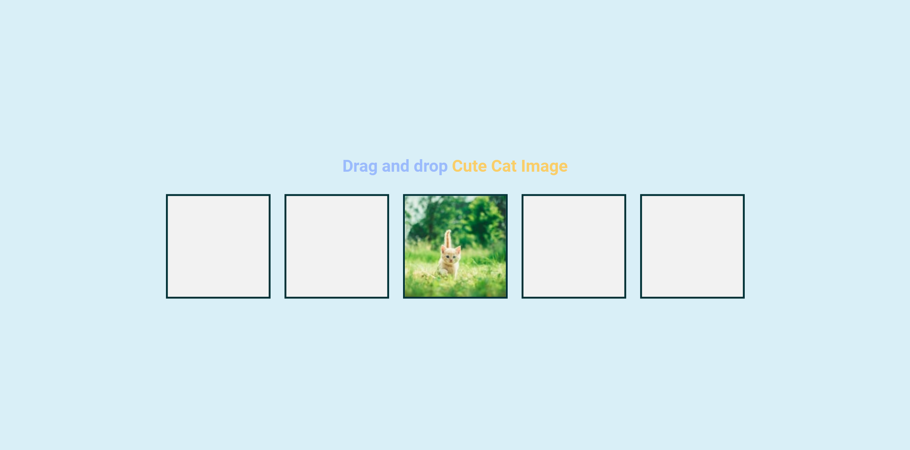

# 50 Projects in 50 Days

## C0. Drag N Drop

This is the solution to the **Drag N Drop** of this "50 Projects in 50 Days" series. In this series you can see different types of projects using different concepts of JavaScript, CSS and HTML.

## Table of contents

- [Overview](#overview)
  - [Snapshots](#snapshots)
  - [Links](#links)
- [My process](#my-process)
  - [Built with](#built-with)
  - [Concepts Used](#concepts-used)
  - [Continued development](#continued-development)
  - [Useful resources](#useful-resources)
- [Author](#author)
- [Acknowledgments](#acknowledgments)

## Overview

There are some boxes in the screen. To drag and drop, we have an random image of cat in one of the boxes.

Now you have two way to move that image. Either you left click on the image , keep pressing, move cursor to the box you choose and leave the right click on that box. Or you can double click on the image, image become movable. Now move cursor to the box you choose and image will drop there.

While you move image from its position, that box and other boxes where you move your cursor, will have different background and border than others have, to indicate that image is on that box.

### Snapshots

Image on page load :

Image after drag :

### Links

- Solution URL: [Source Code](https://github.com/SoniBasant/50-Projects-on-JS-DOM/tree/main/C0.%20Drag%20and%20Drop)
- Live Site URL: [Live link](https://sonibasant.github.io/50-Projects-on-JS-DOM/C0.%20Drag%20and%20Drop/dragNDrop.html)

## My process

### Built with

- Semantic HTML5 markup
- CSS custom properties
- Vanilla JavaScript
- Flexbox
- Desktop-first workflow
- "unsplash" for random image of Cat

### Concepts used

- querySelector()
- querySelectorAll()
- addEventListener() -> dragStart, dragend, dragover, dragenter, dragleave, drop
- .className to set the class attribute
- setTimeout()
- preventDefault()
- append
- for loop

### Continued development

Need to work on design and background.

Your suggestions are welcome. 🙌

### Useful resources

- [Udemy](https://www.udemy.com/course/50-projects-50-days/) - Udemy course on DOM 🤝
- [freecodecamp](https://www.freecodecamp.org/) - All the problems I solved. Helped me a lot. 🙌
- [w3schools](https://www.w3schools.com) - This helped me throughout my journey. Still doing. 🙂
- [Google API](https://fonts.googleapis.com/css2?family=Roboto:wght@400;700&display=swap) - For font 🆎
- [Unsplash API](https://source.unsplash.com/random/150x150/?cat) - For random _cat_ image 🐈 🐱

## Author

Basant Soni 👨‍💻

- GitHub - [@SoniBasant](https://github.com/SoniBasant)
- Frontend Mentor - [@SoniBasant](https://www.frontendmentor.io/profile/SoniBasant)
- CodePen - [@SoniBasant](https://codepen.io/sonibasant)
- Hashnode - [@SoniBasant](https://sonibasant.hashnode.dev/)

## Acknowledgments

Two people who made this 50 projects series -

- [Brad Traversy](https://github.com/bradtraversy)
- [Florin Pop](https://github.com/florinpop17)
