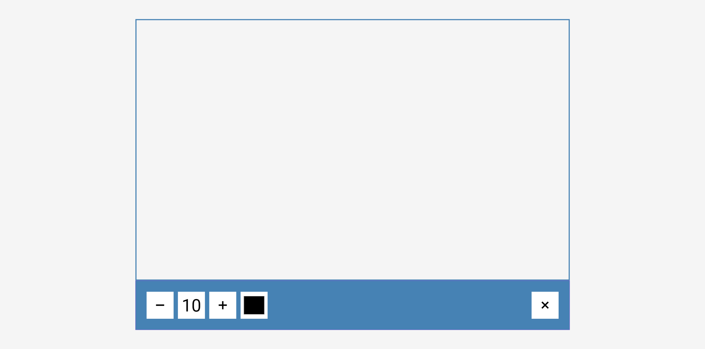
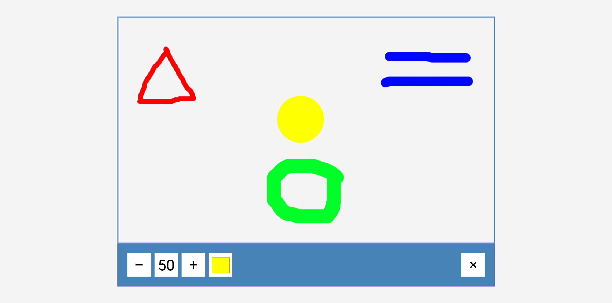
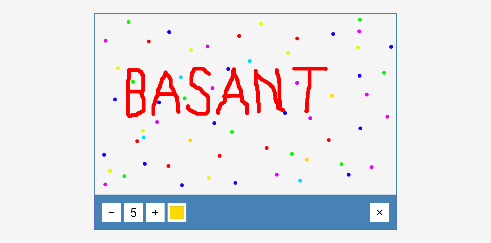

# 50 Projects in 50 Days

## C1. Drawing App

This is the solution to the **Drawing App** of this "50 Projects in 50 Days" series. In this series you can see different types of projects using different concepts of JavaScript, CSS and HTML.

## Table of contents

- [Overview](#overview)
  - [Snapshots](#snapshots)
  - [Links](#links)
- [My process](#my-process)
  - [Built with](#built-with)
  - [Concepts Used](#concepts-used)
  - [Continued development](#continued-development)
  - [Useful resources](#useful-resources)
- [Author](#author)
- [Acknowledgments](#acknowledgments)

## Overview

In this `Drawing app` , you have option to change pen size from 5 to 50. Originally, It starts from 10. You can choose your color also from the color palette. A clear button is also there to clean the drawing area.

### Snapshots

Drawing App on page load :

Shapes with different pen size and colour :

My Name with polka dot background :

**Statutory Warning** : `Coding doesn't teach you drawing.` 😟

### Links

- Solution URL: [Source Code](https://github.com/SoniBasant/50-Projects-on-JS-DOM/tree/main/C1.%20Drawing%20App)
- Live Site URL: [Live link](https://sonibasant.github.io/50-Projects-on-JS-DOM/C1.%20Drawing%20App/drawingApp.html)

## My process

### Built with

- Semantic HTML5 markup

- CSS custom properties
- Vanilla JavaScript
- Flexbox
- Desktop-first workflow
- HTML Canvas

### Concepts used

- getElementById()

- addEventListener() -> mousedown, mouseup, mousemove, change, click
- offsetX and offsetY
- innerHTML
- if..else
- :last-child selector
- arrow function

And some **important** concepts -

- canvas > beginPath, fill, stroke, moveTo, lineTo, arc, lineWidth, strokeStyle, clearRect

- canvas.width and canvas.height

### Continued development

Need to work on design and background.

We can add -

- Predefined shapes

- Input from keyboard
- Eraser

And many more functions.

Your suggestions are welcome. 🙌

### Useful resources

- [Udemy](https://www.udemy.com/course/50-projects-50-days/) - Udemy course on DOM 🤝
- [freecodecamp](https://www.freecodecamp.org/) - All the problems I solved. Helped me a lot. 🙌
- [w3schools](https://www.w3schools.com) - This helped me throughout my journey. Still doing. 🙂
- [Google API](https://fonts.googleapis.com/css2?family=Roboto:wght@400;700&display=swap) - For font 🆎

## Author

Basant Soni 👨‍💻

- GitHub - [@SoniBasant](https://github.com/SoniBasant)
- Frontend Mentor - [@SoniBasant](https://www.frontendmentor.io/profile/SoniBasant)
- CodePen - [@SoniBasant](https://codepen.io/sonibasant)
- Hashnode - [@SoniBasant](https://sonibasant.hashnode.dev/)

## Acknowledgments

Two people who made this 50 projects series -

- [Brad Traversy](https://github.com/bradtraversy)
- [Florin Pop](https://github.com/florinpop17)
