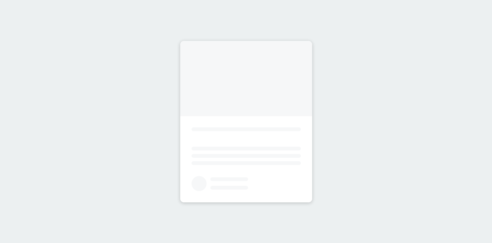
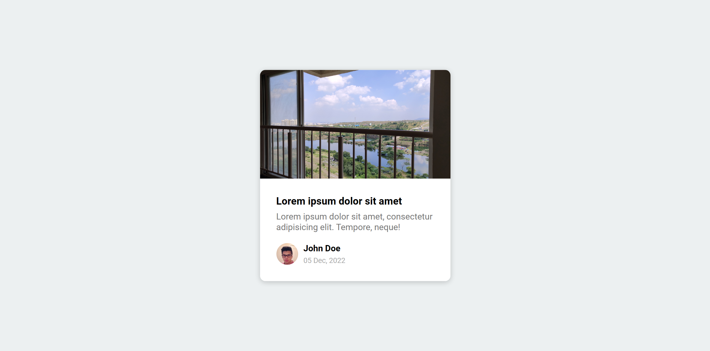

# 50 Projects in 50 Days

## C3. Content Placeholder

This is the solution to the **Content Placeholder** of this "50 Projects in 50 Days" series. In this series you can see different types of projects using different concepts of JavaScript, CSS and HTML.

## Table of contents

- [Overview](#overview)
  - [Snapshots](#snapshots)
  - [Links](#links)
- [My process](#my-process)
  - [Built with](#built-with)
  - [Concepts Used](#concepts-used)
  - [Continued development](#continued-development)
  - [Useful resources](#useful-resources)
- [Author](#author)
- [Acknowledgments](#acknowledgments)

## Overview

When any page loads, you will see some greyish moving screen instead of content. These are content placeholder. This can be used for texts, images, symbols and anything you say content.

### Snapshots

Page `during` loading :

Page `after` loading :

### Links

- Solution URL: [Source Code](https://github.com/SoniBasant/50-Projects-on-JS-DOM/tree/main/C3.%20Content%20Placeholder)
- Live Site URL: [Live link](https://sonibasant.github.io/50-Projects-on-JS-DOM/C3.%20Content%20Placeholder/contentPH.html)

## My process

### Built with

- Semantic HTML5 markup

- CSS custom properties
- Flexbox
- Desktop-first workflow

### Concepts used

- getElementById()

- querySelectorAll()
- setTimeout(function, time in ms)
- innerHTML
- forEach()
- classList.remove()
- arrow function
- @keyframes

### Continued development

Need to work on design and background.

Your suggestions are welcome. 🙌

### Useful resources

- [Udemy](https://www.udemy.com/course/50-projects-50-days/) - Udemy course on DOM 🤝
- [freecodecamp](https://www.freecodecamp.org/) - All the problems I solved. Helped me a lot. 🙌
- [w3schools](https://www.w3schools.com) - This helped me throughout my journey. Still doing. 🙂
- [Google API](https://fonts.googleapis.com/css2?family=Roboto:wght@400;700&display=swap) - For font 🆎
- [randomuser API](https://randomuser.me/api/portraits/men/45.jpg) - For image of random user 👨

## Author

Basant Soni 👨‍💻

- GitHub - [@SoniBasant](https://github.com/SoniBasant)
- Frontend Mentor - [@SoniBasant](https://www.frontendmentor.io/profile/SoniBasant)
- CodePen - [@SoniBasant](https://codepen.io/sonibasant)
- Hashnode - [@SoniBasant](https://sonibasant.hashnode.dev/)

## Acknowledgments

Two people who made this 50 projects series -

- [Brad Traversy](https://github.com/bradtraversy)
- [Florin Pop](https://github.com/florinpop17)
