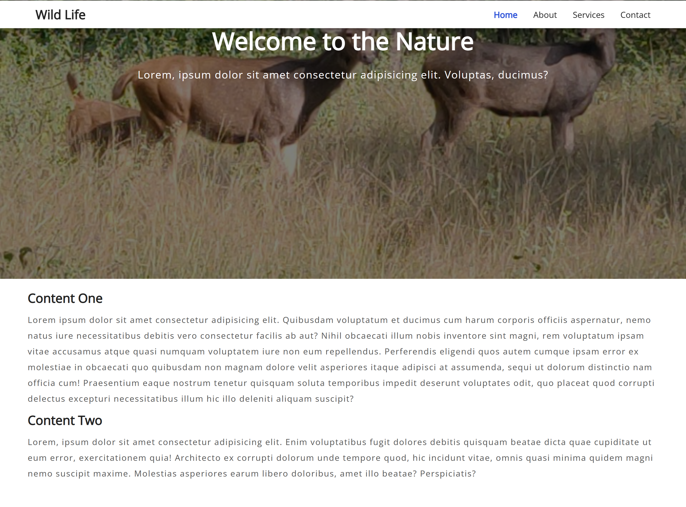

# 50 Projects in 50 Days

## C4. Sticky Navbar

This is the solution to the **Sticky Navbar** of this "50 Projects in 50 Days" series. In this series you can see different types of projects using different concepts of JavaScript, CSS and HTML.

## Table of contents

- [Overview](#overview)
  - [Snapshots](#snapshots)
  - [Links](#links)
- [My process](#my-process)
  - [Built with](#built-with)
  - [Concepts Used](#concepts-used)
  - [Continued development](#continued-development)
  - [Useful resources](#useful-resources)
- [Author](#author)
- [Acknowledgments](#acknowledgments)

## Overview

This project is to show how Sticky Navigation works. This navigation bar is changeable in its parameter; size, background-color, font-color etc.

### Snapshots

Navbar normally > dark background with light font color :

Navbar after `scroll` > smaller height, light background with dark font color :

### Links

- Solution URL: [Source Code](https://github.com/SoniBasant/50-Projects-on-JS-DOM/tree/main/C4.%20Sticky%20Navbar)
- Live Site URL: [Live link](https://sonibasant.github.io/50-Projects-on-JS-DOM/C4.%20Sticky%20Navbar/stickyNav.html)

## My process

### Built with

- JavaScript

- Semantic HTML5 markup

- CSS custom properties

- Flexbox

- Desktop-first workflow

### Concepts used

- querySelector()

- addEventListener() > scroll
- classList.add
- classList.remove
- @import

And some **important** concepts -

- scrollY

- offsetHeight

### Continued development

Need to work on design and background.

Your suggestions are welcome. 🙌

### Useful resources

- [Udemy](https://www.udemy.com/course/50-projects-50-days/) - Udemy course on DOM 🤝
- [freecodecamp](https://www.freecodecamp.org/) - All the problems I solved. Helped me a lot. 🙌
- [w3schools](https://www.w3schools.com) - This helped me throughout my journey. Still doing. 🙂
- [Google API](https://fonts.googleapis.com/css?family=Open+Sans) - For font 🆎

## Author

Basant Soni 👨‍💻

- GitHub - [@SoniBasant](https://github.com/SoniBasant)
- Frontend Mentor - [@SoniBasant](https://www.frontendmentor.io/profile/SoniBasant)
- CodePen - [@SoniBasant](https://codepen.io/sonibasant)
- Hashnode - [@SoniBasant](https://sonibasant.hashnode.dev/)

## Acknowledgments

Two people who made this 50 projects series -

- [Brad Traversy](https://github.com/bradtraversy)
- [Florin Pop](https://github.com/florinpop17)
