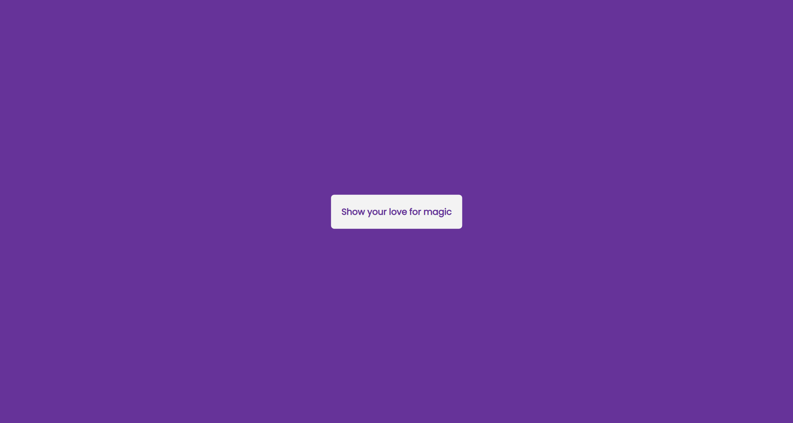
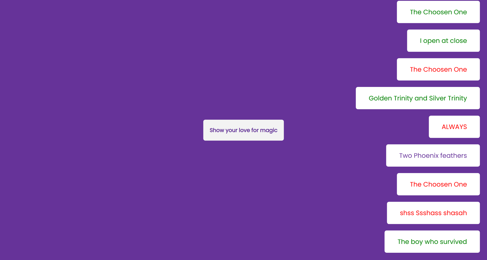

# 50 Projects in 50 Days

## C6. Toast Notification

This is the solution to the **Toast Notification** of this "50 Projects in 50 Days" series. In this series you can see different types of projects using different concepts of JavaScript, CSS and HTML.

## Table of contents

- [Overview](#overview)
  - [Snapshots](#snapshots)
  - [Links](#links)
- [My process](#my-process)
  - [Built with](#built-with)
  - [Concepts Used](#concepts-used)
  - [Continued development](#continued-development)
  - [Useful resources](#useful-resources)
- [Author](#author)
- [Acknowledgments](#acknowledgments)

## Overview

`Toast notifications` are used to notify user about any recent activity through a message. For the project, we will create them through a click of button. You will get random message with random color. Also, message will disappear after certain time.

About the messages, I used theme from **Harry Potter** series.

### Snapshots

Primary screen page :

Page after clicking button to get notification :

### Links

- Solution URL: [Source Code](https://github.com/SoniBasant/50-Projects-on-JS-DOM/tree/main/C6.%20Toast%20Notification)
- Live Site URL: [Live link](https://sonibasant.github.io/50-Projects-on-JS-DOM/C6.%20Toast%20Notification/toastNotification.html)

## My process

### Built with

- JavaScript

- Semantic HTML5 markup

- CSS custom properties

- Flexbox

- Desktop-first workflow

### Concepts used

- getElementById()

- arrays
- addEventListener() > click
- createElement
- classList.add
- appendChild
- innerText
- Math.floor()
- Math.random()
- arraow function
- element.remove()

And some **important** concepts -

- Ternary operator

- setTimeout()

### Continued development

Need to work on design and background.

Your suggestions are welcome. 🙌

### Useful resources

- [Udemy](https://www.udemy.com/course/50-projects-50-days/) - Udemy course on DOM 🤝
- [freecodecamp](https://www.freecodecamp.org/) - All the problems I solved. Helped me a lot. 🙌
- [w3schools](https://www.w3schools.com) - This helped me throughout my journey. Still doing. 🙂
- [Google API](https://fonts.googleapis.com/css2?family=Poppins:wght@200;400&display=swap) - For font 🆎

## Author

Basant Soni 👨‍💻

- GitHub - [@SoniBasant](https://github.com/SoniBasant)
- Frontend Mentor - [@SoniBasant](https://www.frontendmentor.io/profile/SoniBasant)
- CodePen - [@SoniBasant](https://codepen.io/sonibasant)
- Hashnode - [@SoniBasant](https://sonibasant.hashnode.dev/)

## Acknowledgments

Two people who made this 50 projects series -

- [Brad Traversy](https://github.com/bradtraversy)
- [Florin Pop](https://github.com/florinpop17)
