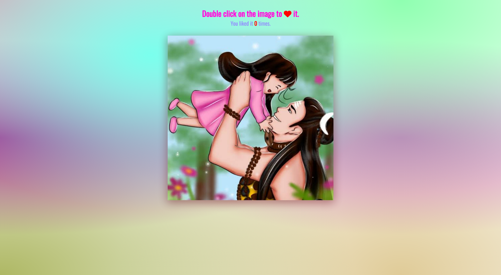

# 50 Projects in 50 Days

## C8. Double Heart Click

This is the solution to the **Double Heart Click** of this "50 Projects in 50 Days" series. In this series you can see different types of projects using different concepts of JavaScript, CSS and HTML.

## Table of contents

- [Overview](#overview)
  - [Snapshots](#snapshots)
  - [Links](#links)
- [My process](#my-process)
  - [Built with](#built-with)
  - [Concepts Used](#concepts-used)
  - [Continued development](#continued-development)
  - [Useful resources](#useful-resources)
- [Author](#author)
- [Acknowledgments](#acknowledgments)

## Overview

There is a beautiful image. You can like it by double clicking on it and a heart will appear on the image. It will be expand and fade away within a second.

There is also a counter to display number of times you like that image. For every double click you will see a random color of heart. Also, the double click is coded in JavaScript.

### Snapshots

Primary screen :

Page after some double clicks :

### Links

- Solution URL: [Source Code](https://github.com/SoniBasant/50-Projects-on-JS-DOM/tree/main/C8.%20Double%20Heart%20Click)
- Live Site URL: [Live link](https://sonibasant.github.io/50-Projects-on-JS-DOM/C8.%20Double%20Heart%20Click/doubleHeartClick.html)

⚠️ Disclaimer: Copyright of the image does NOT belongs to me. Rights belong to the original owner. No copyright infringement intended.

## My process

### Built with

- JavaScript

- Semantic HTML5 markup

- CSS custom properties

- Flexbox

- Desktop-first workflow

### Concepts used

- querySelector()
- addEventListener() > click

- createElement
- classList

- template literals
- appendChild
- setTimeout
- element.remove
- Math.random() and Math.floor()
- arrow function
- if...else
- @keyframes
- transform, translate

And some **important** concepts -

- Date().getTime()

- offsetLeft, offsetTop
- clientX, clientY

### Continued development

Need to work on design, color scheme and background.

Your suggestions are welcome. 🙌

### Useful resources

- [Udemy](https://www.udemy.com/course/50-projects-50-days/) - Udemy course on DOM 🤝
- [freecodecamp](https://www.freecodecamp.org/) - All the problems I solved. Helped me a lot. 🙌
- [w3schools](https://www.w3schools.com) - This helped me throughout my journey. Still doing. 🙂
- [Google API](https://fonts.googleapis.com/css?family=Oswald) - For font Oswald 🆎

## Author

Basant Soni 👨‍💻

- GitHub - [@SoniBasant](https://github.com/SoniBasant)
- Frontend Mentor - [@SoniBasant](https://www.frontendmentor.io/profile/SoniBasant)
- CodePen - [@SoniBasant](https://codepen.io/sonibasant)
- Hashnode - [@SoniBasant](https://sonibasant.hashnode.dev/)

## Acknowledgments

Two people who made this 50 projects series -

- [Brad Traversy](https://github.com/bradtraversy)
- [Florin Pop](https://github.com/florinpop17)
