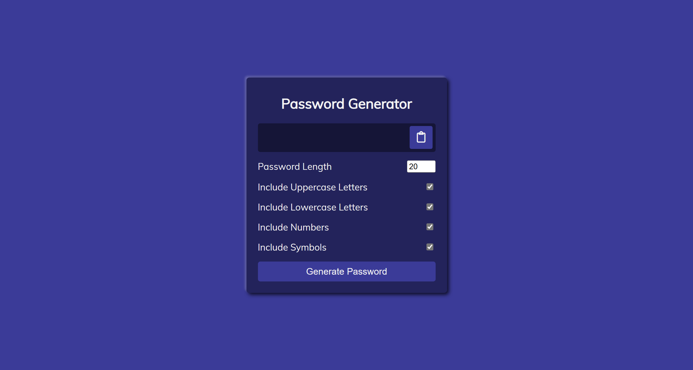
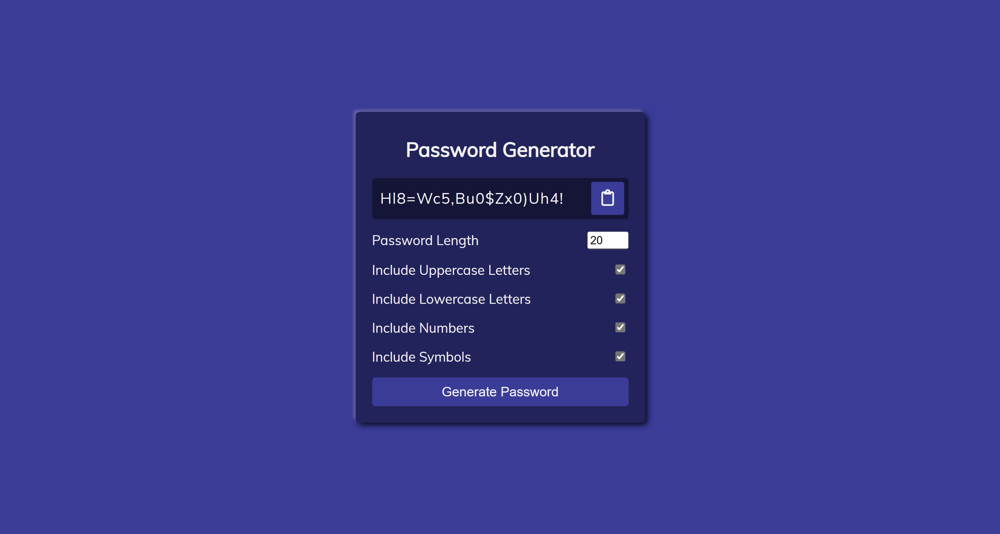

# 50 Projects in 50 Days

## D0. Password Generator

This is the solution to the **Password Generator** of this "50 Projects in 50 Days" series. In this series you can see different types of projects using different concepts of JavaScript, CSS and HTML.

## Table of contents

- [Overview](#overview)
  - [Snapshots](#snapshots)
  - [Links](#links)
- [My process](#my-process)
  - [Built with](#built-with)
  - [Concepts Used](#concepts-used)
  - [Continued development](#continued-development)
  - [Useful resources](#useful-resources)
- [Author](#author)
- [Acknowledgments](#acknowledgments)

## Overview

This password generator helps you to generate password with different combination containing uppercase, lowercase, numbers and symbols. You can decide the length of password.

Also, you can copy the password.

### Snapshots

Primary Screen :

Full length password with all combination :

Changed length password with some combination :

### Links

- Solution URL: [Source Code](https://github.com/SoniBasant/50-Projects-on-JS-DOM/tree/main/D0.%20Password%20Generator)
- Live Site URL: [Live link](https://sonibasant.github.io/50-Projects-on-JS-DOM/D0.%20Password%20Generator/pwdGenerator.html)

## My process

### Built with

- JavaScript

- Semantic HTML5 markup

- CSS custom properties

- Flexbox

- Desktop-first workflow

### Concepts used

- getElementById()

- addEventListener() > click
- alert()
- .checked
- .slice
- Math.floor()
- Math.random()
- filter
- arrow function
- if
- for
- element.value

And some **important** concepts -

- navigator.clipboard.writeText()

- String.fromCharCode() > to return a string created from specified sequence of UTF-16 code units code

  numbers-> (0 - 9) = (48 - 57)

  uppercase letters-> (A - Z) = (65 - 90)

  lowercase letters-> (a - z) = (97 - 122)

### Continued development

Need to work on design, color scheme and background.

Your suggestions are welcome. 🙌

### Useful resources

- [Udemy](https://www.udemy.com/course/50-projects-50-days/) - Udemy course on DOM 🤝
- [freecodecamp](https://www.freecodecamp.org/) - All the problems I solved. Helped me a lot. 🙌
- [w3schools](https://www.w3schools.com) - This helped me throughout my journey. Still doing. 🙂
- [Google API](https://fonts.googleapis.com/css?family=Muli&display=swap) - For font Muli 🆎

## Author

Basant Soni 👨‍💻

- GitHub - [@SoniBasant](https://github.com/SoniBasant)
- Frontend Mentor - [@SoniBasant](https://www.frontendmentor.io/profile/SoniBasant)
- CodePen - [@SoniBasant](https://codepen.io/sonibasant)
- Hashnode - [@SoniBasant](https://sonibasant.hashnode.dev/)

## Acknowledgments

Two people who made this 50 projects series -

- [Brad Traversy](https://github.com/bradtraversy)
- [Florin Pop](https://github.com/florinpop17)
