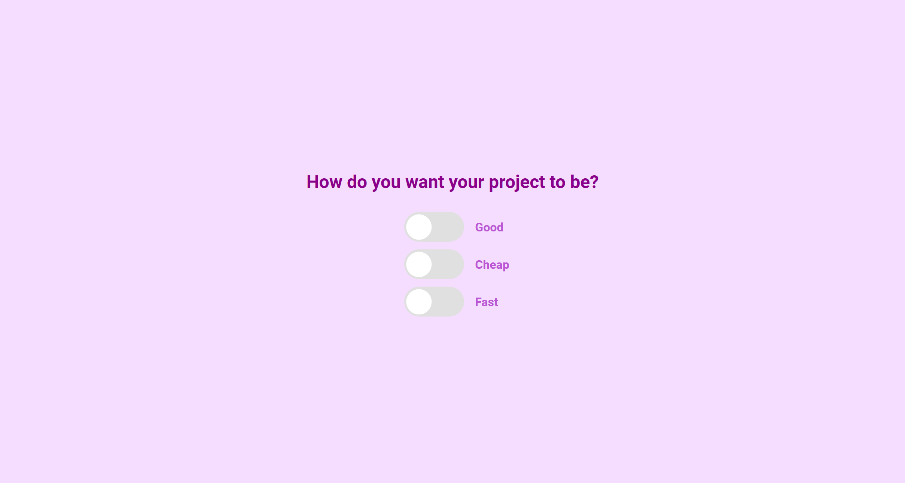
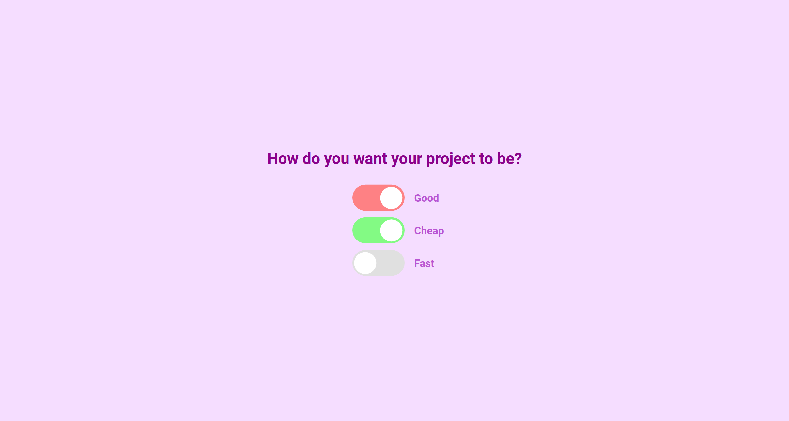
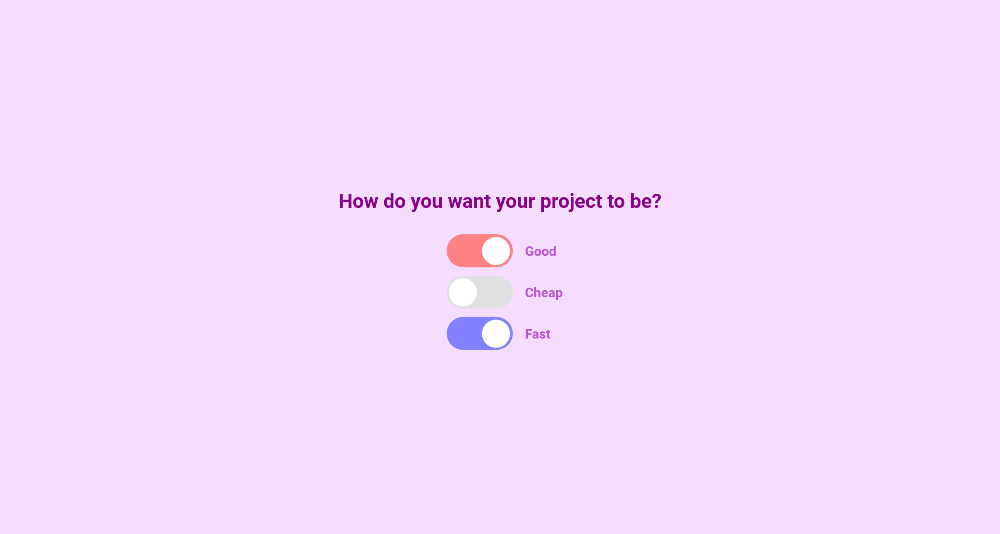
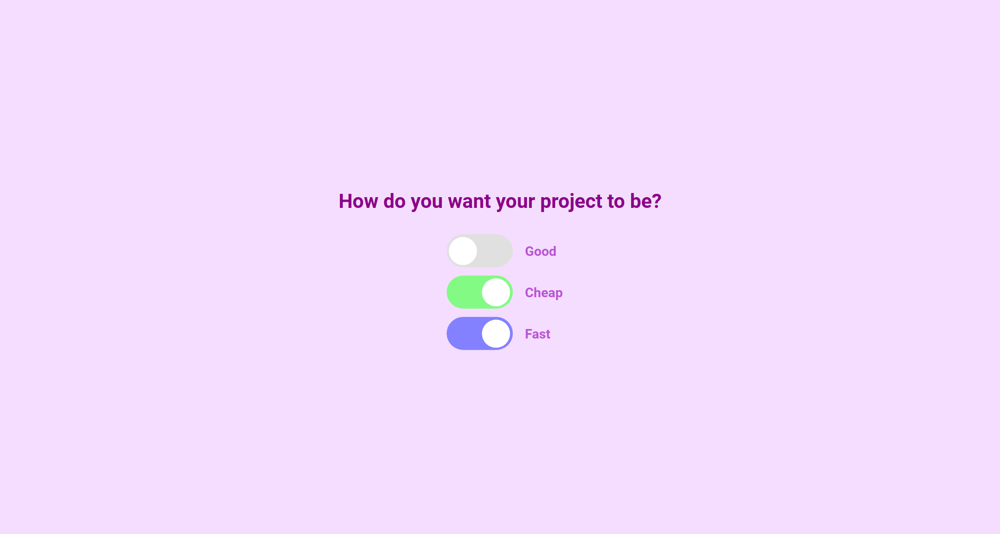

# 50 Projects in 50 Days

## D1. Good, Cheap and Fast Checkboxes

This is the solution to the **Good, Cheap and Fast Checkboxes** of this "50 Projects in 50 Days" series. In this series you can see different types of projects using different concepts of JavaScript, CSS and HTML.

## Table of contents

- [Overview](#overview)
  - [Snapshots](#snapshots)
  - [Links](#links)
- [My process](#my-process)
  - [Built with](#built-with)
  - [Concepts Used](#concepts-used)
  - [Continued development](#continued-development)
  - [Useful resources](#useful-resources)
- [Author](#author)
- [Acknowledgments](#acknowledgments)

## Overview

This project is helpful to learn about logic with an example. You can NOT have `Good`, `Cheap` and `Fast` project at the same time. You have to compromise atleast on one of them.

There are three toggle buttons for the same. Try to see which one gets unchecked when you try to check all of them.

### Snapshots

Primary Screen :

Good and Cheap but `NOT Fast` :

Good and Fast but `Not Cheap` :

Cheap and Fast but `Not Good` :

### Links

- Solution URL: [Source Code](https://github.com/SoniBasant/50-Projects-on-JS-DOM/tree/main/D1.%20Good%2C%20Cheap%2C%20Fast%20Checkboxes)

- Live Site URL: [Live link](https://sonibasant.github.io/50-Projects-on-JS-DOM/D1.%20Good%2C%20Cheap%2C%20Fast%20Checkboxes/gcfCheckBox.html)

## My process

### Built with

- JavaScript

- Semantic HTML5 markup

- CSS custom properties

- Flexbox

- Desktop-first workflow

### Concepts used

- querySelector()

- querySelectorAll()
- forEach()
- if, logical operator
- arrow function
- target
- addEventListener() > change
- @keyframes
- :root

### Continued development

Need to work on design and background.

Your suggestions are welcome. 🙌

### Useful resources

- [Udemy](https://www.udemy.com/course/50-projects-50-days/) - Udemy course on DOM 🤝

- [freecodecamp](https://www.freecodecamp.org/) - All the problems I solved. Helped me a lot. 🙌
- [w3schools](https://www.w3schools.com) - This helped me throughout my journey. Still doing. 🙂
- [Google API](https://fonts.googleapis.com/css2?family=Roboto:wght@400;700&display=swap) - For font Roboto 🆎

## Author

Basant Soni 👨‍💻

- GitHub - [@SoniBasant](https://github.com/SoniBasant)

- Frontend Mentor - [@SoniBasant](https://www.frontendmentor.io/profile/SoniBasant)
- CodePen - [@SoniBasant](https://codepen.io/sonibasant)
- Hashnode - [@SoniBasant](https://sonibasant.hashnode.dev/)

## Acknowledgments

Two people who made this 50 projects series -

- [Brad Traversy](https://github.com/bradtraversy)

- [Florin Pop](https://github.com/florinpop17)
