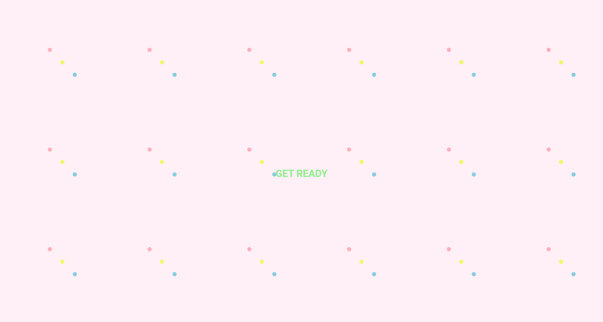
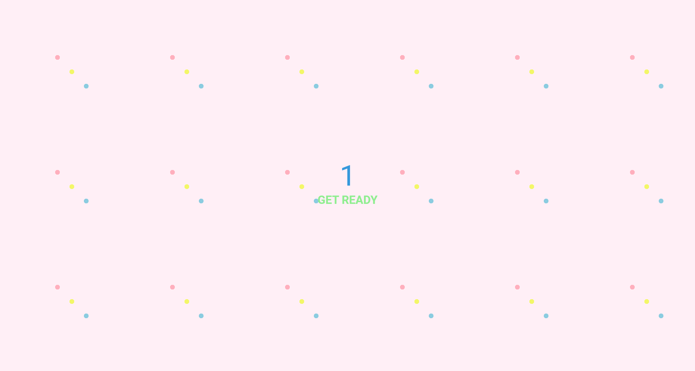
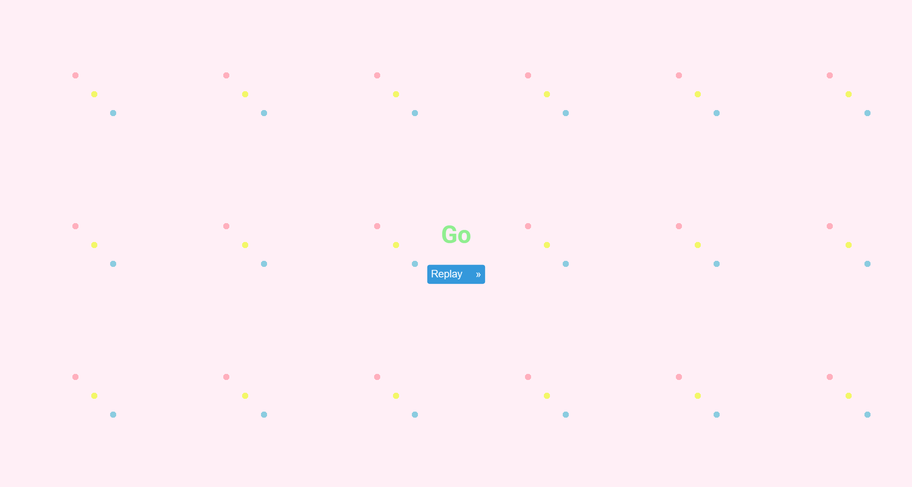

# 50 Projects in 50 Days

## D3. Animated Countdown

This is the solution to the **Animated Countdown** of this "50 Projects in 50 Days" series. In this series you can see different types of projects using different concepts of JavaScript, CSS and HTML.

## Table of contents

- [Overview](#overview)
  - [Snapshots](#snapshots)
  - [Links](#links)
- [My process](#my-process)
  - [Built with](#built-with)
  - [Concepts Used](#concepts-used)
  - [Continued development](#continued-development)
  - [Useful resources](#useful-resources)
- [Author](#author)
- [Acknowledgments](#acknowledgments)

## Overview

As soon as page loads, you will see a countdown starts from 3 to 0. After countdown finish, you can replay it by Replay button.

### Snapshots

Primary Screen on load :

During countdown :

After countdown, to replay countdown :

### Links

- Solution URL: [Source Code](https://github.com/SoniBasant/50-Projects-on-JS-DOM/tree/main/D3.%20Animated%20Countdown)

- Live Site URL: [Live link](https://sonibasant.github.io/50-Projects-on-JS-DOM/D3.%20Animated%20Countdown/animCountdown.html)

## My process

### Built with

- JavaScript

- Semantic HTML5 markup

- CSS custom properties

- Flexbox

- Desktop-first workflow

### Concepts used

- querySelectorAll()

- classList > add, remove, value
- forEach()
- addEventListener() > animationend, click
- if...else
- @keyframes
- transform, translate

And some **important** concepts -

- nextElementSibling

- radial-gradient

### Continued development

Need to work on design and background.

Your suggestions are welcome. 🙌

### Useful resources

- [Udemy](https://www.udemy.com/course/50-projects-50-days/) - Udemy course on DOM 🤝

- [freecodecamp](https://www.freecodecamp.org/) - All the problems I solved. Helped me a lot. 🙌
- [w3schools](https://www.w3schools.com) - This helped me throughout my journey. Still doing. 🙂
- [Google API](https://fonts.googleapis.com/css2?family=Roboto:wght@400;700&display=swap) - For font Roboto 🆎

## Author

Basant Soni 👨‍💻

- GitHub - [@SoniBasant](https://github.com/SoniBasant)

- Frontend Mentor - [@SoniBasant](https://www.frontendmentor.io/profile/SoniBasant)
- CodePen - [@SoniBasant](https://codepen.io/sonibasant)
- Hashnode - [@SoniBasant](https://sonibasant.hashnode.dev/)

## Acknowledgments

Two people who made this 50 projects series -

- [Brad Traversy](https://github.com/bradtraversy)

- [Florin Pop](https://github.com/florinpop17)

The background of this project is customized by me. I got the inspiration for it from **Poonam Soni**. Her twitter account is [@CodeByPoonam](https://twitter.com/CodeByPoonam).
