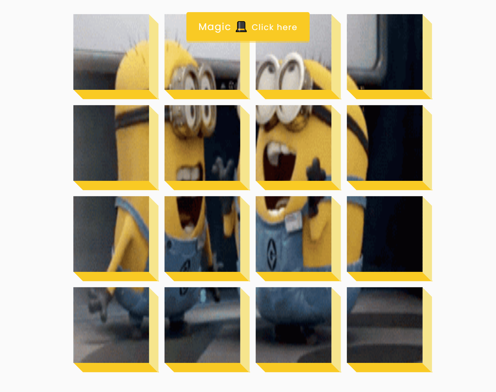
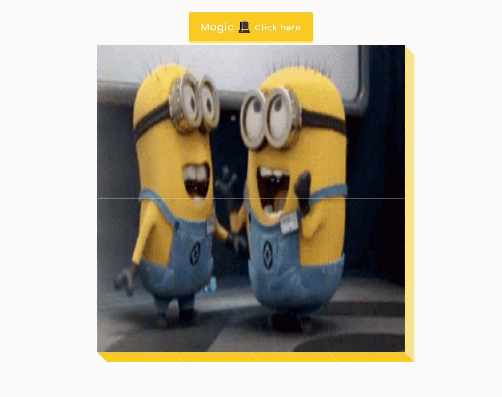

# 50 Projects in 50 Days

## D9. 3D Background Boxes

This is the solution to the **3D Background Boxes** of this "50 Projects in 50 Days" series. In this series you can see different types of projects using different concepts of JavaScript, CSS and HTML.

## Table of contents

- [Overview](#overview)
  - [Snapshots](#snapshots)
  - [Links](#links)
- [My process](#my-process)
  - [Built with](#built-with)
  - [Concepts Used](#concepts-used)
  - [Continued development](#continued-development)
  - [Useful resources](#useful-resources)
- [Author](#author)
- [Acknowledgments](#acknowledgments)

## Overview

😃 Using GIF and transform properties, we make this cool project. You can see gif is divided into many equal parts. By clicking on the button, divided Gif become one single Gif. 😃

### Snapshots

**Divided Gif :**

**Combine into one :**

### Links

- Solution URL: [Source Code](https://github.com/SoniBasant/50-Projects-on-JS-DOM/tree/main/D9.%203D%20Background%20Boxes)

- Live Site URL: [Live link](https://sonibasant.github.io/50-Projects-on-JS-DOM/D9.%203D%20Background%20Boxes/3DBackGBoxes.html)

## My process

### Built with

- JavaScript

- Customized CSS classes

- Semantic HTML5 markup

- Desktop-first workflow

### Concepts used

- getElementById()

- for loop
- createElement()
- classList > add and toggle
- Template literals
- appendChild()
- addEventListener() > click
- arrow function

Some **important** concepts -

- element.style.backgroundPosition

- transform, translate, transition

### Continued development

Need to work on design and background.

Your suggestions are welcome. 🙌

### Useful resources

- [Udemy](https://www.udemy.com/course/50-projects-50-days/) - Udemy course on DOM 🤝

- [freecodecamp](https://www.freecodecamp.org/) - All the problems I solved. Helped me a lot. 🙌
- [w3schools](https://www.w3schools.com) - This helped me throughout my journey. Still doing. 🙂
- [Google API](https://fonts.googleapis.com/css2?family=Poppins&display=swap) - For font Poppins 🆎
- [Giphy](https://media.giphy.com/media/EZqwsBSPlvSda/giphy.gif) - For Gif

## Author

Basant Soni 👨‍💻

- GitHub - [@SoniBasant](https://github.com/SoniBasant)

- Frontend Mentor - [@SoniBasant](https://www.frontendmentor.io/profile/SoniBasant)
- CodePen - [@SoniBasant](https://codepen.io/sonibasant)
- Hashnode - [@SoniBasant](https://sonibasant.hashnode.dev/)

## Acknowledgments

Two people who made this 50 projects series -

- [Brad Traversy](https://github.com/bradtraversy)

- [Florin Pop](https://github.com/florinpop17)
