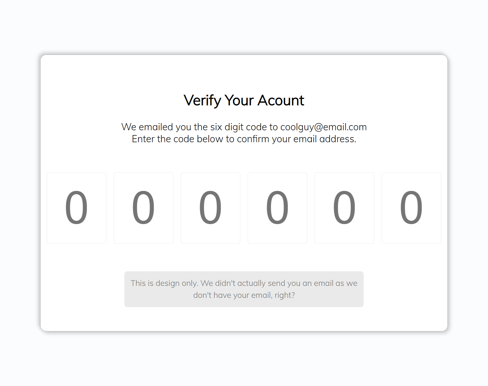
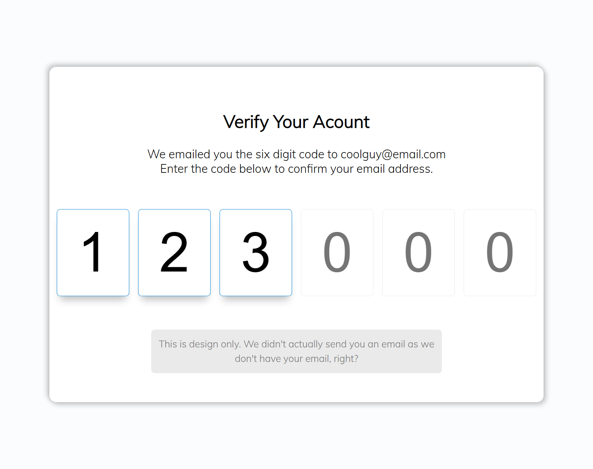
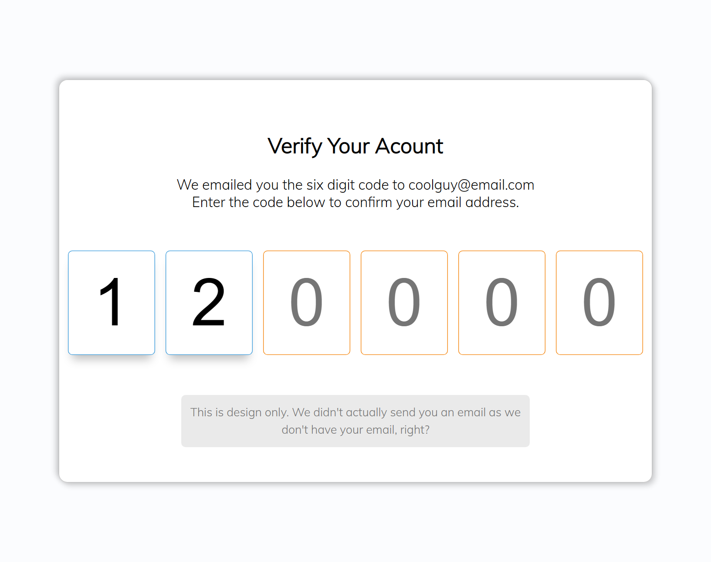
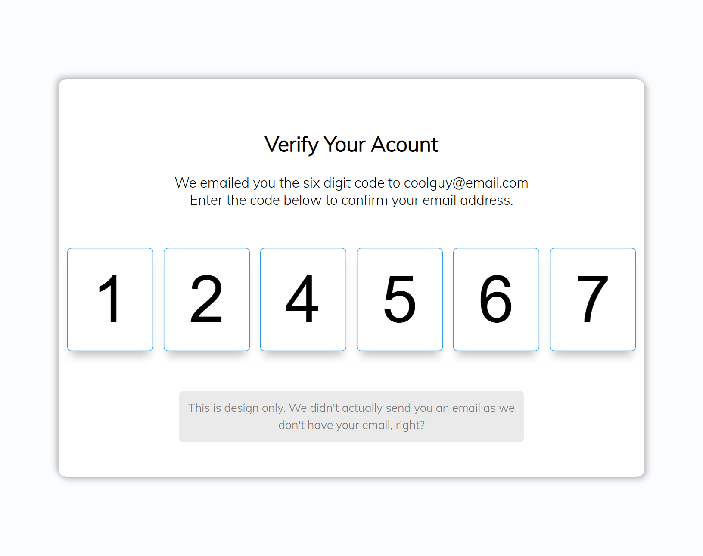

# 50 Projects in 50 Days

## E0. Verify Account UI

This is the solution to the **Verify Account UI** of this "50 Projects in 50 Days" series. In this series you can see different types of projects using different concepts of JavaScript, CSS and HTML.

## Table of contents

- [Overview](#overview)
  - [Snapshots](#snapshots)
  - [Links](#links)
- [My process](#my-process)
  - [Built with](#built-with)
  - [Concepts Used](#concepts-used)
  - [Continued development](#continued-development)
  - [Useful resources](#useful-resources)
- [Author](#author)
- [Acknowledgments](#acknowledgments)

## Overview

To make your account in a website, sometimes you need to verify your email ID. You will generate a code which is send to your email. The same code needs to verify in a form.

This is that form. All initial values are zero by default. As you enter digits in the space provided, color of that block's border become blue.

I added color, orange, for the next one also. Additionally, if you press backspace, the current digit become zero again with orange border in that block.

### Snapshots

**Primary Screen :**

**Partially filled :**

**Go back to correct it :**

**Completely filled :**

### Links

- Solution URL: [Source Code](https://github.com/SoniBasant/50-Projects-on-JS-DOM/tree/main/E0.%20Verify%20Account%20UI)

- Live Site URL: [Live link](https://sonibasant.github.io/50-Projects-on-JS-DOM/E0.%20Verify%20Account%20UI/verifyACUI.html)

## My process

### Built with

- JavaScript

- Customized CSS classes

- Semantic HTML5 markup

- Desktop-first workflow

### Concepts used

- querySelectorAll()

- focus()
- addEventListener() > keydown
- if...else
- element.style.borderColor
- arrow function
- forEach()
- .value
- @media

Some **important** concepts -

- -webkit-outer-spin-button CSS pseudo-element to style input element

- -webkit-inner-spin-button
- setTimeout(function, time in ms)

### Continued development

After _backspace_, active one is in blue border. That should be in orange. Need to correct.

Need to work on design and background.

Your suggestions are welcome. 🙌

### Useful resources

- [Udemy](https://www.udemy.com/course/50-projects-50-days/) - Udemy course on DOM 🤝

- [freecodecamp](https://www.freecodecamp.org/) - All the problems I solved. Helped me a lot. 🙌
- [w3schools](https://www.w3schools.com) - This helped me throughout my journey. Still doing. 🙂
- [Google API](https://fonts.googleapis.com/css2?family=Poppins&display=swap) - For font Poppins 🆎

## Author

Basant Soni 👨‍💻

- GitHub - [@SoniBasant](https://github.com/SoniBasant)

- Frontend Mentor - [@SoniBasant](https://www.frontendmentor.io/profile/SoniBasant)
- CodePen - [@SoniBasant](https://codepen.io/sonibasant)
- Hashnode - [@SoniBasant](https://sonibasant.hashnode.dev/)

## Acknowledgments

Two people who made this 50 projects series -

- [Brad Traversy](https://github.com/bradtraversy)

- [Florin Pop](https://github.com/florinpop17)
