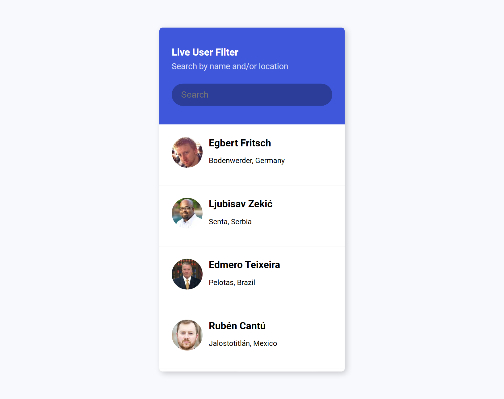
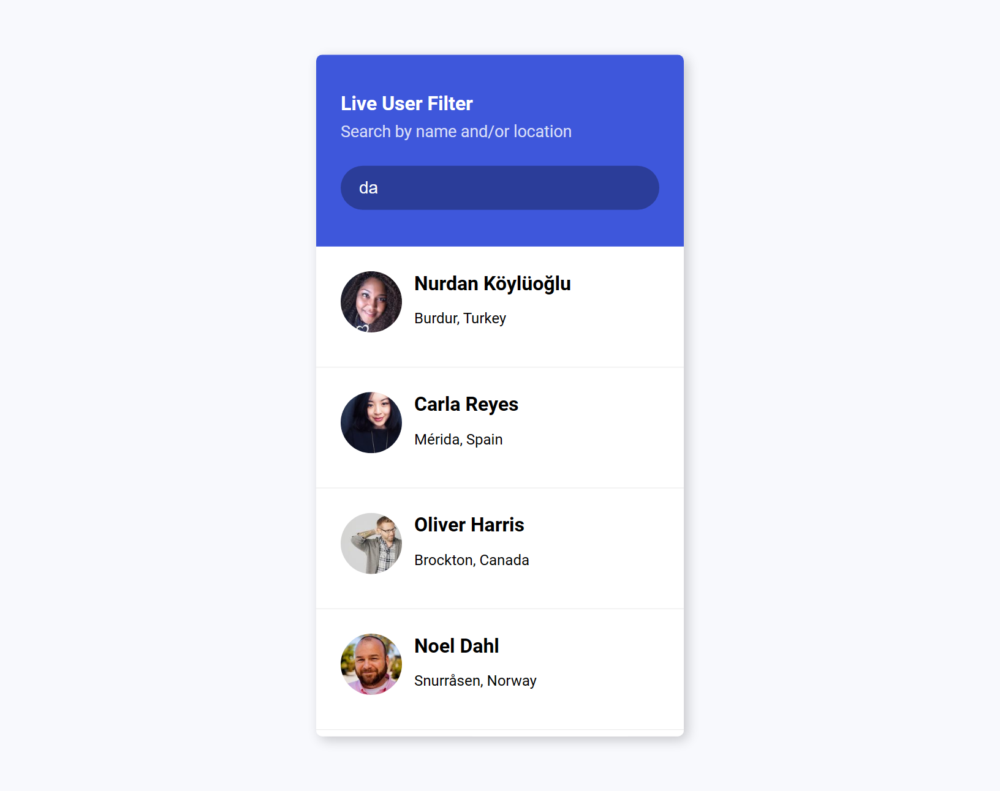

# 50 Projects in 50 Days

## E1. Live User Filter

This is the solution to the **Live User Filter** of this "50 Projects in 50 Days" series. In this series you can see different types of projects using different concepts of JavaScript, CSS and HTML.

## Table of contents

- [Overview](#overview)
  - [Snapshots](#snapshots)
  - [Links](#links)
- [My process](#my-process)
  - [Built with](#built-with)
  - [Concepts Used](#concepts-used)
  - [Continued development](#continued-development)
  - [Useful resources](#useful-resources)
- [Author](#author)
- [Acknowledgments](#acknowledgments)

## Overview

To show working of filter, we use API of randomuser. This API gives us data to display like first name, last name, city, country and image.

By typing any data, of course other than image, you can find the person as per your requirement. Like you can type united states and you will get all user who are living in United states. No need to worry about lowercase or uppercase.

### Snapshots

**Primary Screen :**

**Using filter :**

### Links

- Solution URL: [Source Code](https://github.com/SoniBasant/50-Projects-on-JS-DOM/tree/main/E1.%20Live%20User%20Filter)

- Live Site URL: [Live link](https://sonibasant.github.io/50-Projects-on-JS-DOM/E1.%20Live%20User%20Filter/liveUserFilter.html)

## My process

### Built with

- JavaScript

- Customized CSS classes
- Semantic HTML5 markup
- Desktop-first workflow
- API

### Concepts used

- getElementById()

- addEventListener() > input
- innerHTML
- forEach()
- createElement()
- template literals
- appendChild()
- classList > add and remove
- arrow function
- if..else

Some **important** concepts -

For API-

- async, await, fetch

For filter -

- toLowerCase()

- includes()

### Continued development

Need to work on design and background.

Your suggestions are welcome. 🙌

### Useful resources

- [Udemy](https://www.udemy.com/course/50-projects-50-days/) - Udemy course on DOM 🤝

- [freecodecamp](https://www.freecodecamp.org/) - All the problems I solved. Helped me a lot. 🙌
- [w3schools](https://www.w3schools.com) - This helped me throughout my journey. Still doing. 🙂
- [Google API](https://fonts.googleapis.com/css2?family=Roboto:wght@400;700&display=swap) - For font Roboto 🆎
- [Random User API](https://randomuser.me/api?results=50) - For information of random user 👨‍🔬

## Author

Basant Soni 👨‍💻

- GitHub - [@SoniBasant](https://github.com/SoniBasant)

- Frontend Mentor - [@SoniBasant](https://www.frontendmentor.io/profile/SoniBasant)
- CodePen - [@SoniBasant](https://codepen.io/sonibasant)
- Hashnode - [@SoniBasant](https://sonibasant.hashnode.dev/)

## Acknowledgments

Two people who made this 50 projects series -

- [Brad Traversy](https://github.com/bradtraversy)

- [Florin Pop](https://github.com/florinpop17)
