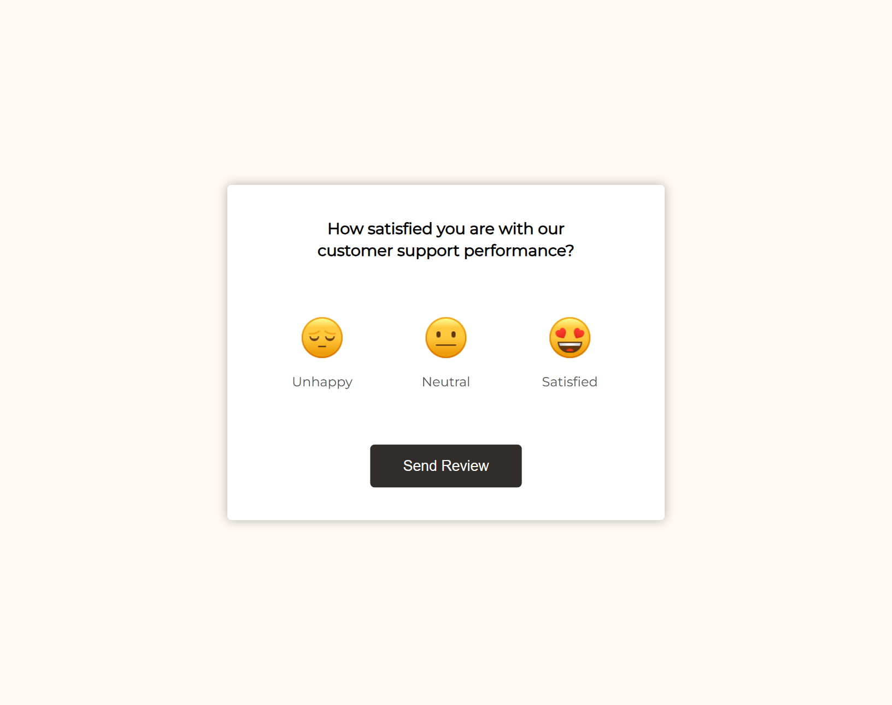
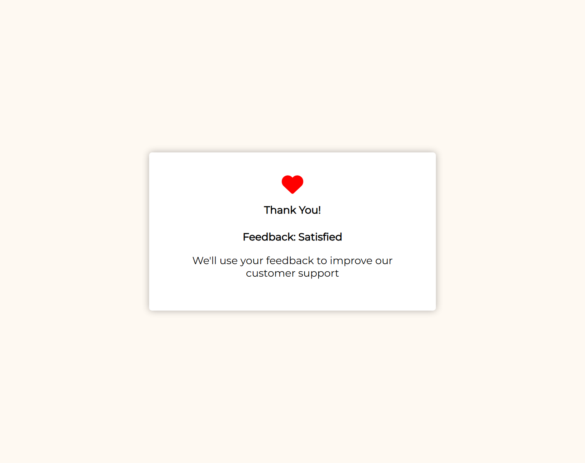
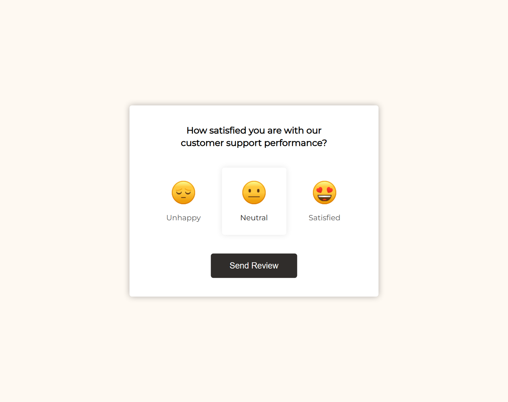
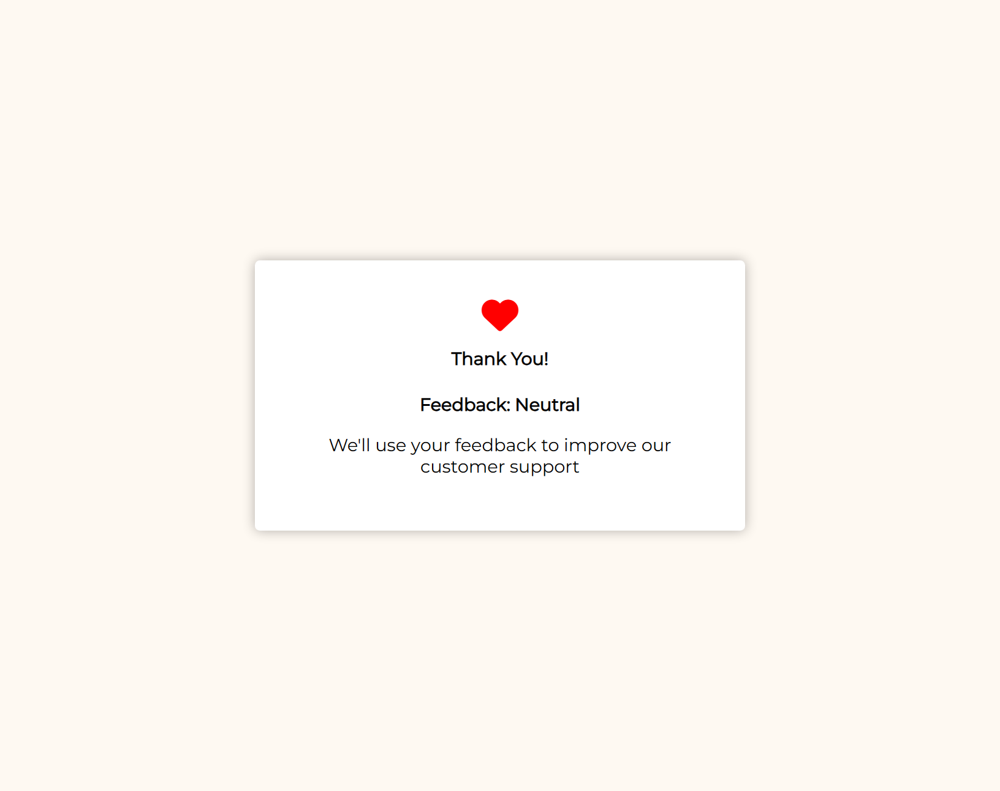

# 50 Projects in 50 Days

## E2. Feedback UI Design

This is the solution to the **Feedback UI Design** of this "50 Projects in 50 Days" series. In this series you can see different types of projects using different concepts of JavaScript, CSS and HTML.

## Table of contents

- [Overview](#overview)
  - [Snapshots](#snapshots)
  - [Links](#links)
- [My process](#my-process)
  - [Built with](#built-with)
  - [Concepts Used](#concepts-used)
  - [Continued development](#continued-development)
  - [Useful resources](#useful-resources)
- [Author](#author)
- [Acknowledgments](#acknowledgments)

## Overview

Many times you were asked to give feedback. This project is about the same, giving feedback. You are presented with three options with respective emojis.

Unhappy 😔 | Neutral 😐 | Satisfied 😍

If you select any of the three and click on Send Review button, you will get a thank you message which also contain your chosen feedback. Satisfied is the default pre-selected option if you don't choose any feedback.

### Snapshots

**To give feedback: Primary screen**

**Thank you message: If nothing is selected, `Satisfied` is pre-selected**

**When select `Neutral`:**

**Thank you message: For `Neutral`**

### Links

- Solution URL: [Source Code](https://github.com/SoniBasant/50-Projects-on-JS-DOM/tree/main/E2.%20Feedback%20UI%20Design)

- Live Site URL: [Live link](https://sonibasant.github.io/50-Projects-on-JS-DOM/E2.%20Feedback%20UI%20Design/feedbackUI.html)

## My process

### Built with

- JavaScript

- Customized CSS classes
- Semantic HTML5 markup
- Desktop-first workflow
- Responsive design

### Concepts used

- querySelector()

- addEventListener() > click
- classList > contains(), add(), remove()
- for loop
- template literals
- if...else
- arrow function

Some **important** concepts -

- Event bubbling

- parentNode
- nextElementSibling
- previousSibling
- previousElementSibling

### Continued development

Need to work on design and background.

Your suggestions are welcome. 🙌

### Useful resources

- [Udemy](https://www.udemy.com/course/50-projects-50-days/) - Udemy course on DOM 🤝

- [freecodecamp](https://www.freecodecamp.org/) - All the problems I solved. Helped me a lot. 🙌
- [w3schools](https://www.w3schools.com) - This helped me throughout my journey. Still doing. 🙂
- [Google API](https://fonts.googleapis.com/css?family=Montserrat&display=swap) - For font Montserrat 🆎
- [icons8](https://img.icons8.com/external-neu-royyan-wijaya/64/000000/external-emoji-neumojis-smiley-neu-royyan-wijaya-17.png) - For emojis 😔 😐 😍

## Author

Basant Soni 👨‍💻

- GitHub - [@SoniBasant](https://github.com/SoniBasant)

- Frontend Mentor - [@SoniBasant](https://www.frontendmentor.io/profile/SoniBasant)
- CodePen - [@SoniBasant](https://codepen.io/sonibasant)
- Hashnode - [@SoniBasant](https://sonibasant.hashnode.dev/)

## Acknowledgments

Two people who made this 50 projects series -

- [Brad Traversy](https://github.com/bradtraversy)

- [Florin Pop](https://github.com/florinpop17)
