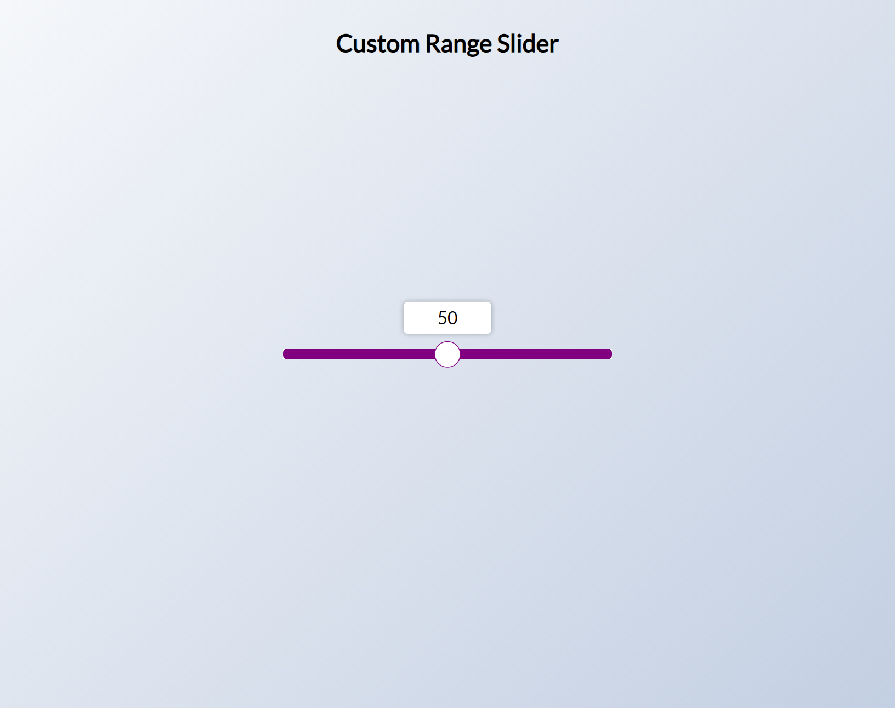
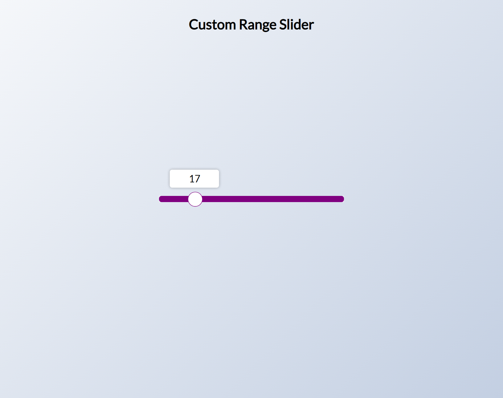
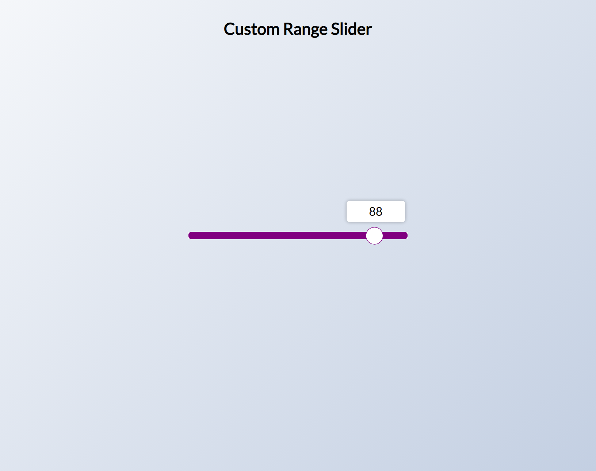

# 50 Projects in 50 Days

## E3. Custom Range Slider

This is the solution to the **Custom Range Slider** of this "50 Projects in 50 Days" series. In this series you can see different types of projects using different concepts of JavaScript, CSS and HTML.

## Table of contents

- [Overview](#overview)
  - [Snapshots](#snapshots)
  - [Links](#links)
- [My process](#my-process)
  - [Built with](#built-with)
  - [Concepts Used](#concepts-used)
  - [Continued development](#continued-development)
  - [Useful resources](#useful-resources)
- [Author](#author)
- [Acknowledgments](#acknowledgments)

## Overview

Range slider starts from 50, at center by default. You can also see the numbers at the top of slider. Click, hold and move the circle presented at the center of slider and digits will show you how much you moved.

### Snapshots

**Primary screen: Slider at 50**

**Slider at lower value**

**Slider at higher value**

### Links

- Solution URL: [Source Code](https://github.com/SoniBasant/50-Projects-on-JS-DOM/tree/main/E3.%20Custom%20Range%20Slider)

- Live Site URL: [Live link](https://sonibasant.github.io/50-Projects-on-JS-DOM/E3.%20Custom%20Range%20Slider/customRangeSlider.html)

## My process

### Built with

- JavaScript

- Customized CSS classes
- Semantic HTML5 markup
- Desktop-first workflow
- Responsive design

### Concepts used

- getElementById()

- addEventListener() > input
- e.target > for range
- nextElementSibling
- .min and .max
- arrow function
- Template literals
- input type: range

Some **important** concepts -

- getComputedStyle() > to return an object containing values of all CSS properties of element

- getPropertyValue() > return a string containing value of specifies CSS property
- substring > to extracts characters b/w two positions
- scale() for conversion of one type of range to another > map a range of numbers to another range of numbers
- -webkit-appearance

### Continued development

Change the color of slider as number increases and decreases. Also make the digits non-selective.

Need to work on design and background.

Your suggestions are welcome. 🙌

### Useful resources

- [Udemy](https://www.udemy.com/course/50-projects-50-days/) - Udemy course on DOM 🤝

- [freecodecamp](https://www.freecodecamp.org/) - All the problems I solved. Helped me a lot. 🙌
- [w3schools](https://www.w3schools.com) - This helped me throughout my journey. Still doing. 🙂
- [Google API](https://fonts.googleapis.com/css?family=Lato&display=swap) - For font Lato 🆎
- [stackoverflow](https://stackoverflow.com/) - On changing range of numbers

## Author

Basant Soni 👨‍💻

- GitHub - [@SoniBasant](https://github.com/SoniBasant)

- Frontend Mentor - [@SoniBasant](https://www.frontendmentor.io/profile/SoniBasant)
- CodePen - [@SoniBasant](https://codepen.io/sonibasant)
- Hashnode - [@SoniBasant](https://sonibasant.hashnode.dev/)

## Acknowledgments

Two people who made this 50 projects series -

- [Brad Traversy](https://github.com/bradtraversy)

- [Florin Pop](https://github.com/florinpop17)

The person who answered the question "map a range of numbers to another range of numbers" on stackoverflow.

- [August Miller](https://stackoverflow.com/questions/10756313/javascript-jquery-map-a-range-of-numbers-to-another-range-of-numbers)
