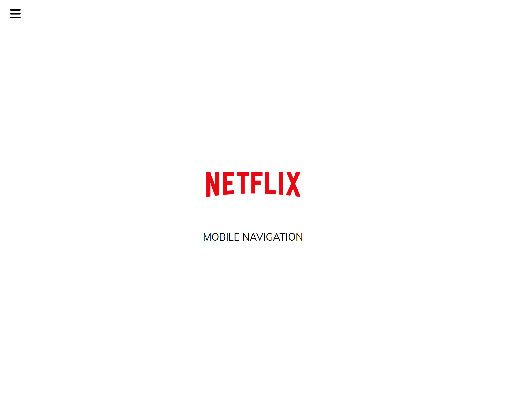
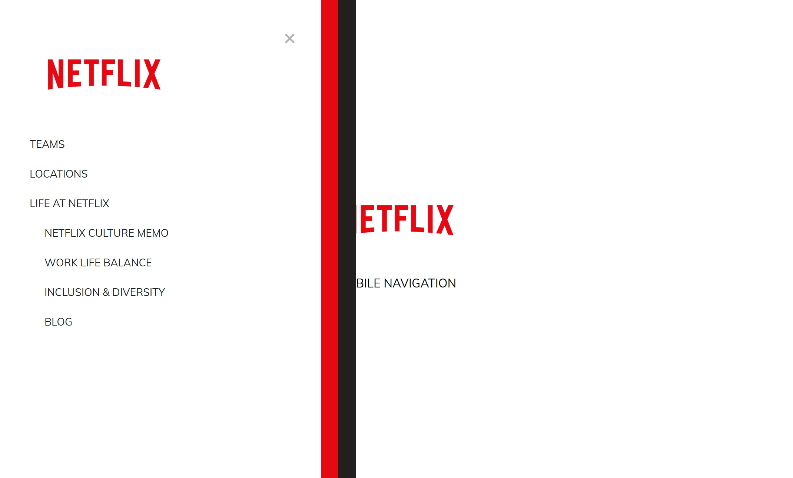

# 50 Projects in 50 Days

## E4. Netflix Navigation

This is the solution to the **Netflix Navigation** of this "50 Projects in 50 Days" series. In this series you can see different types of projects using different concepts of JavaScript, CSS and HTML.

## Table of contents

- [Overview](#overview)
  - [Snapshots](#snapshots)
  - [Links](#links)
- [My process](#my-process)
  - [Built with](#built-with)
  - [Concepts Used](#concepts-used)
  - [Continued development](#continued-development)
  - [Useful resources](#useful-resources)
- [Author](#author)
- [Acknowledgments](#acknowledgments)

## Overview

This is mobile version navigation of Netflix. As mobile don't have that much screen space as in computer/laptop, navigation is hidden. To look it, you have to click on menu bars. A close icon (X) will hide navigation again.

### Snapshots

**Primary screen on page load**

**Screen on navigation display**

### Links

- Solution URL: [Source Code](https://github.com/SoniBasant/50-Projects-on-JS-DOM/tree/main/E4.%20Netflix%20Navigation)

- Live Site URL: [Live link](https://sonibasant.github.io/50-Projects-on-JS-DOM/E4.%20Netflix%20Navigation/netflixNavigation.html)

## My process

### Built with

- Vanilla JavaScript

- Semantic HTML5 markup
- CSS custom properties
- Flexbox
- Desktop-first workflow

### Concepts used

- querySelectorAll() > give us node FileList, can be loop through

- addEventListener() > click
- forEach()
- classList > add and remove
- arrow function
- transform, translate, transition

### Continued development

Need to work on design and background.

Your suggestions are welcome. 🙌

### Useful resources

- [Udemy](https://www.udemy.com/course/50-projects-50-days/) - Udemy course on DOM 🤝

- [freecodecamp](https://www.freecodecamp.org/) - All the problems I solved. Helped me a lot. 🙌
- [w3schools](https://www.w3schools.com) - This helped me throughout my journey. Still doing. 🙂
- [Google API](https://fonts.googleapis.com/css?family=Muli&display=swap) - For font Muli 🆎
- [Image](https://images.ctfassets.net/4cd45et68cgf/7LrExJ6PAj6MSIPkDyCO86/542b1dfabbf3959908f69be546879952/Netflix-Brand-Logo.png?w=684&h=456) - Netflix Logo

## Author

Basant Soni 👨‍💻

- GitHub - [@SoniBasant](https://github.com/SoniBasant)

- Frontend Mentor - [@SoniBasant](https://www.frontendmentor.io/profile/SoniBasant)
- CodePen - [@SoniBasant](https://codepen.io/sonibasant)
- Hashnode - [@SoniBasant](https://sonibasant.hashnode.dev/)

## Acknowledgments

Two people who made this 50 projects series -

- [Brad Traversy](https://github.com/bradtraversy)

- [Florin Pop](https://github.com/florinpop17)
