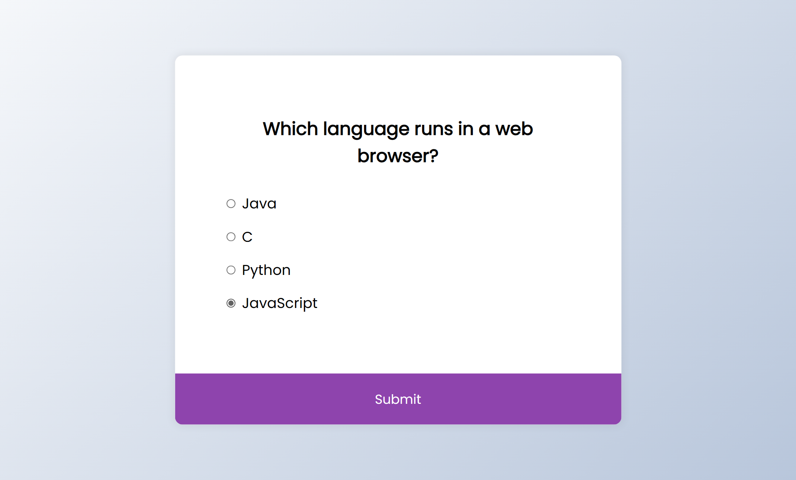
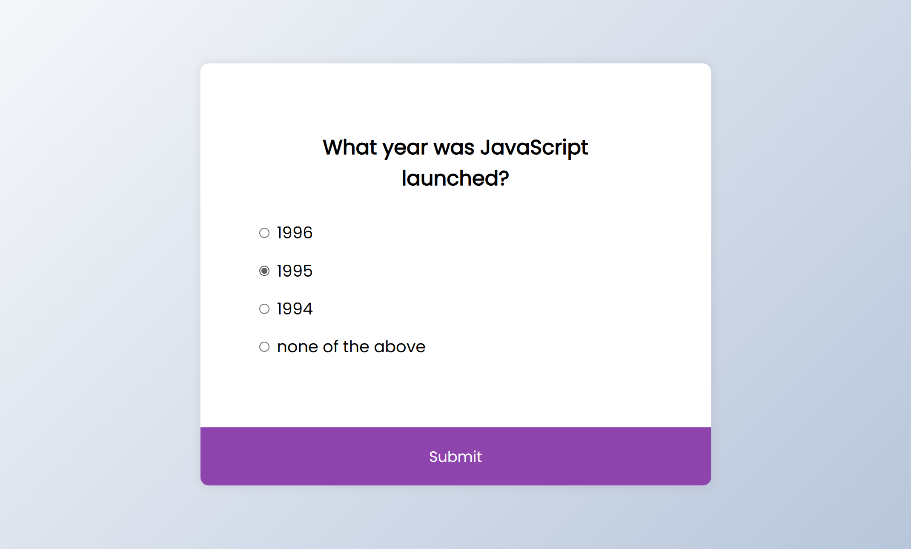
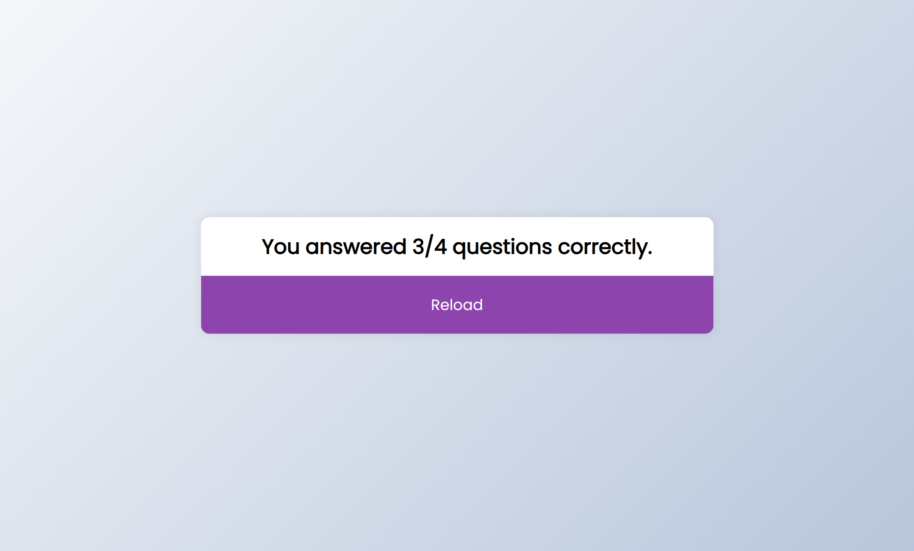

# 50 Projects in 50 Days

## E5. Quiz App

This is the solution to the **Quiz App** of this "50 Projects in 50 Days" series. In this series you can see different types of projects using different concepts of JavaScript, CSS and HTML.

## Table of contents

- [Overview](#overview)
  - [Snapshots](#snapshots)
  - [Links](#links)
- [My process](#my-process)
  - [Built with](#built-with)
  - [Concepts Used](#concepts-used)
  - [Continued development](#continued-development)
  - [Useful resources](#useful-resources)
- [Author](#author)
- [Acknowledgments](#acknowledgments)

## Overview

Like any quiz, you have a question and 4 options to select your answer. After selection, you will submit your answer and go to the next question. After the last question you can see your score and can reload the quiz.

### Snapshots

**Primary screen on page load: 1st question**

**On selecting one option**

**Another question with selected option**

**Score message**

### Links

- Solution URL: [Source Code](https://github.com/SoniBasant/50-Projects-on-JS-DOM/tree/main/E5.%20Quiz%20App)

- Live Site URL: [Live link](https://sonibasant.github.io/50-Projects-on-JS-DOM/E5.%20Quiz%20App/quizApp.html)

## My process

### Built with

- Vanilla JavaScript

- Semantic HTML5 markup
- CSS custom properties
- Flexbox
- Desktop-first workflow

### Concepts used

- array

- getElementById()
- querySelectorAll()
- forEach()
- if...else
- addEventListener() > click
- innerText
- Template literals
- arrow function

### Continued development

Need to work on design and background.

Your suggestions are welcome. 🙌

### Useful resources

- [Udemy](https://www.udemy.com/course/50-projects-50-days/) - Udemy course on DOM 🤝

- [freecodecamp](https://www.freecodecamp.org/) - All the problems I solved. Helped me a lot. 🙌
- [w3schools](https://www.w3schools.com) - This helped me throughout my journey. Still doing. 🙂
- [Google API](https://fonts.googleapis.com/css2?family=Poppins:wght@200;400&display=swap) - For font Poppins 🆎

## Author

Basant Soni 👨‍💻

- GitHub - [@SoniBasant](https://github.com/SoniBasant)

- Frontend Mentor - [@SoniBasant](https://www.frontendmentor.io/profile/SoniBasant)
- CodePen - [@SoniBasant](https://codepen.io/sonibasant)
- Hashnode - [@SoniBasant](https://sonibasant.hashnode.dev/)

## Acknowledgments

Two people who made this 50 projects series -

- [Brad Traversy](https://github.com/bradtraversy)

- [Florin Pop](https://github.com/florinpop17)
