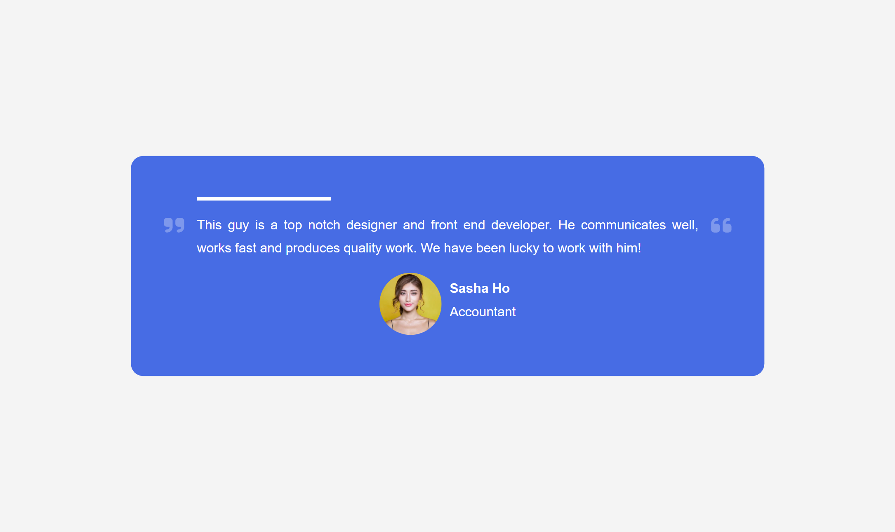
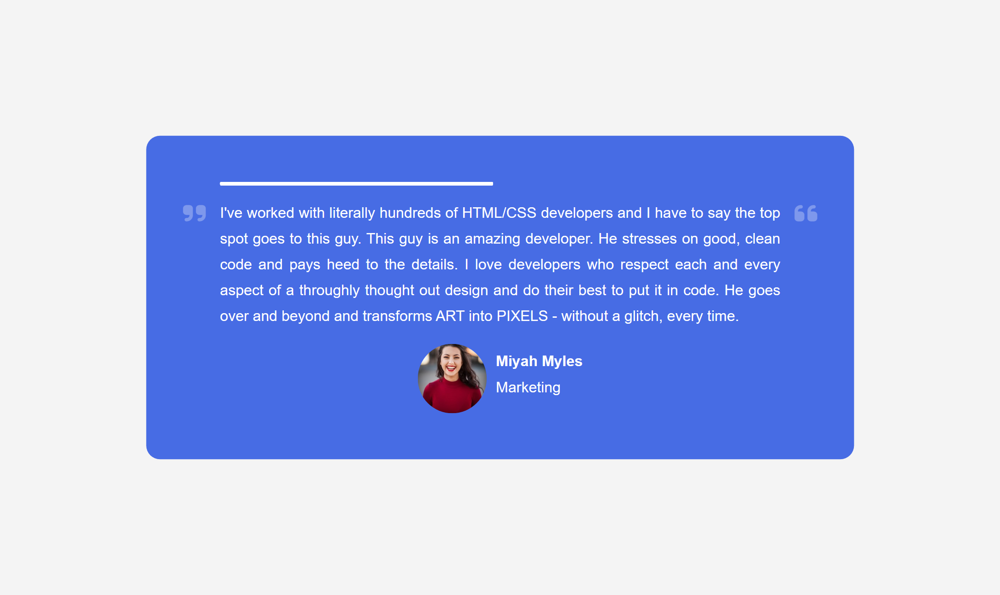
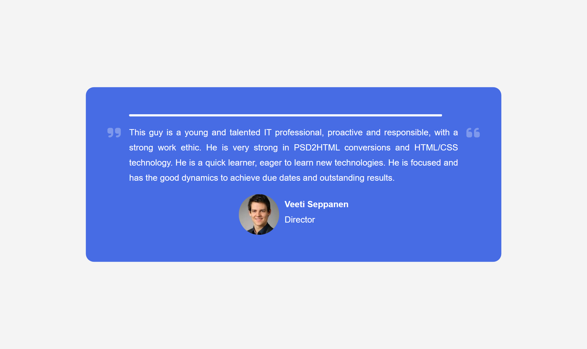

# 50 Projects in 50 Days

## E6. Testimonial Box Switcher

This is the solution to the **Testimonial Box Switcher** of this "50 Projects in 50 Days" series. In this series you can see different types of projects using different concepts of JavaScript, CSS and HTML.

## Table of contents

- [Overview](#overview)
  - [Snapshots](#snapshots)
  - [Links](#links)
- [My process](#my-process)
  - [Built with](#built-with)
  - [Concepts Used](#concepts-used)
  - [Continued development](#continued-development)
  - [Useful resources](#useful-resources)
- [Author](#author)
- [Acknowledgments](#acknowledgments)

## Overview

This project show testimonials of different people about a person in tech who is a good developer. (I think it's me 😉) Testimonial will display for some time, you can see a progress bar, after that a new testimonial will be shown.

### Snapshots

**Primary screen on page load: Testimonial-1**

**Primary screen on page load: Testimonial-2**

**Primary screen on page load: Testimonial-3**

### Links

- Solution URL: [Source Code](https://github.com/SoniBasant/50-Projects-on-JS-DOM/tree/main/E6.%20Testimonial%20Box%20Switcher)

- Live Site URL: [Live link](https://sonibasant.github.io/50-Projects-on-JS-DOM/E6.%20Testimonial%20Box%20Switcher/testimonialBS.html)

## My process

### Built with

- Vanilla JavaScript

- Semantic HTML5 markup
- CSS custom properties
- Flexbox
- Desktop-first workflow

### Concepts used

- querySelector()

- array method
- object
- setInterval()
- innerText
- @keyframes
- @media
- transform-origin
- if

### Continued development

Testimonial should stop after clicking and holding on it.

Need to work on design and background.

Your suggestions are welcome. 🙌

### Useful resources

- [Udemy](https://www.udemy.com/course/50-projects-50-days/) - Udemy course on DOM 🤝

- [freecodecamp](https://www.freecodecamp.org/) - All the problems I solved. Helped me a lot. 🙌
- [w3schools](https://www.w3schools.com) - This helped me throughout my journey. Still doing. 🙂
- [Google API](https://fonts.googleapis.com/css?family=Montsecrrat) - For font Montsecrrat 🆎
- [Random User API](https://randomuser.me/api/portraits/women/68.jpg) - For Random Images 👨‍🔬

## Author

Basant Soni 👨‍💻

- GitHub - [@SoniBasant](https://github.com/SoniBasant)

- Frontend Mentor - [@SoniBasant](https://www.frontendmentor.io/profile/SoniBasant)
- CodePen - [@SoniBasant](https://codepen.io/sonibasant)
- Hashnode - [@SoniBasant](https://sonibasant.hashnode.dev/)

## Acknowledgments

Two people who made this 50 projects series -

- [Brad Traversy](https://github.com/bradtraversy)

- [Florin Pop](https://github.com/florinpop17)
