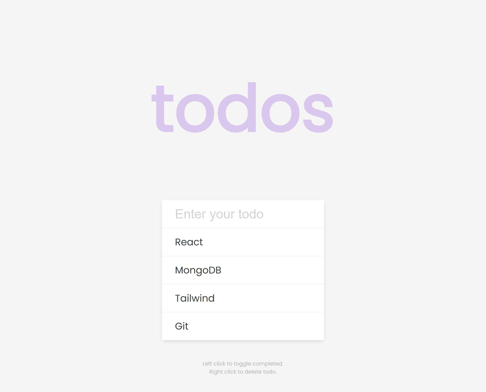

# 50 Projects in 50 Days

## E8. To Do List

This is the solution to the **To Do List** of this "50 Projects in 50 Days" series. In this series you can see different types of projects using different concepts of JavaScript, CSS and HTML.

## Table of contents

- [Overview](#overview)
  - [Snapshots](#snapshots)
  - [Links](#links)
- [My process](#my-process)
  - [Built with](#built-with)
  - [Concepts Used](#concepts-used)
  - [Continued development](#continued-development)
  - [Useful resources](#useful-resources)
- [Author](#author)
- [Acknowledgments](#acknowledgments)

## Overview

A `To Do list` project. You can type your taks, press Enter key and your task is added in the list.

Left click on the task and a line-throuogh will appear on it, indicating completion. Right click on the task and task will be deleted.

### Snapshots

**To do list > Primary screen**

**To do list > After adding some tasks**

**To do list > After deleting and completing some tasks**

### Links

- Solution URL: [Source Code](https://github.com/SoniBasant/50-Projects-on-JS-DOM/tree/main/E8.%20To%20Do%20List)

- Live Site URL: [Live link](https://sonibasant.github.io/50-Projects-on-JS-DOM/E8.%20To%20Do%20List/toDoList.html)

## My process

### Built with

- Vanilla JavaScript

- Semantic HTML5 markup
- CSS custom properties
- Flexbox
- Desktop-first workflow

### Concepts used

- getElementById()

- forEach()
- addEventListener() > click, contextmenu, submit
- preventDefault()
- classList > add, contains and toggle
- createElement()
- querySelectorAll()
- appendChild()
- forEach()
- if
- arrow function
- .value and .text

Some **important** concepts -

- JSON.parse

- JSON.stringify
- localStorage
- get and set method

### Continued development

We can make to-do list draggable.

Need to work on design and background.

Your suggestions are welcome. 🙌

### Useful resources

- [Udemy](https://www.udemy.com/course/50-projects-50-days/) - Udemy course on DOM 🤝

- [freecodecamp](https://www.freecodecamp.org/) - All the problems I solved. Helped me a lot. 🙌
- [w3schools](https://www.w3schools.com) - This helped me throughout my journey. Still doing. 🙂
- [Google API](https://fonts.googleapis.com/css2?family=Poppins:wght@200;400&display=swap) - For font Poppins 🆎

## Author

Basant Soni 👨‍💻

- GitHub - [@SoniBasant](https://github.com/SoniBasant)

- Frontend Mentor - [@SoniBasant](https://www.frontendmentor.io/profile/SoniBasant)
- CodePen - [@SoniBasant](https://codepen.io/sonibasant)
- Hashnode - [@SoniBasant](https://sonibasant.hashnode.dev/)

## Acknowledgments

Two people who made this 50 projects series -

- [Brad Traversy](https://github.com/bradtraversy)

- [Florin Pop](https://github.com/florinpop17)
