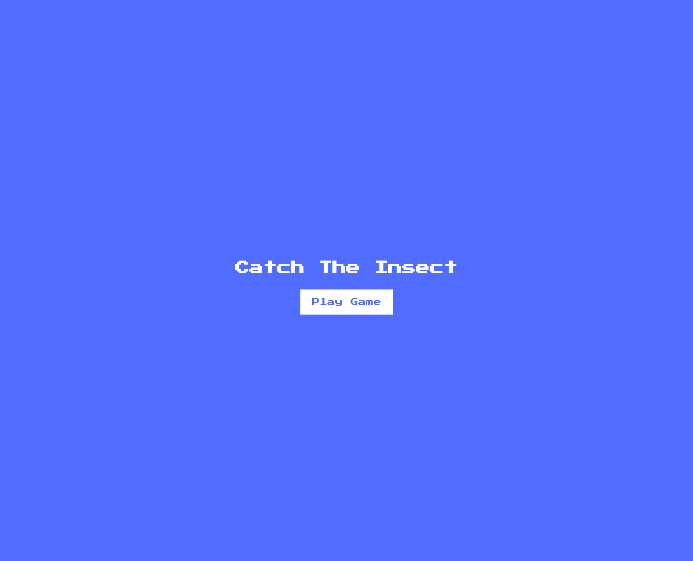
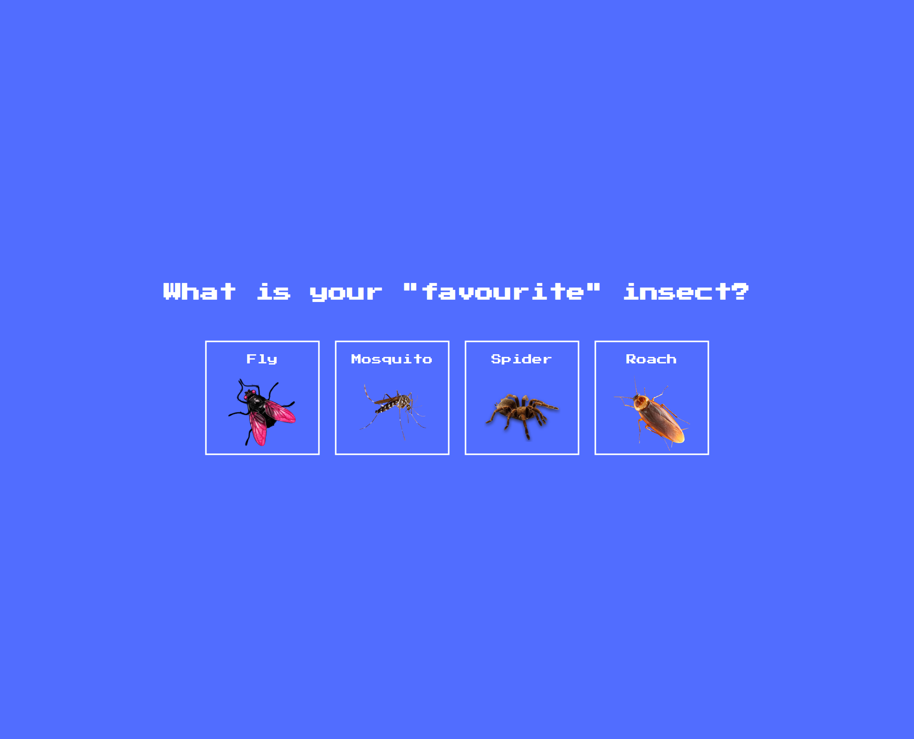
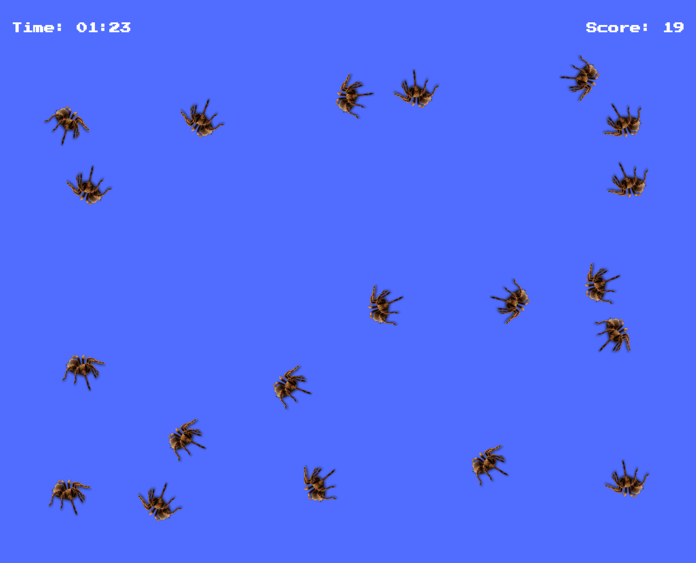

# 50 Projects in 50 Days

## E9. Insect Catch Game

This is the solution to the **Insect Catch Game** of this "50 Projects in 50 Days" series. In this series you can see different types of projects using different concepts of JavaScript, CSS and HTML.

## Table of contents

- [Overview](#overview)
  - [Snapshots](#snapshots)
  - [Links](#links)
- [My process](#my-process)
  - [Built with](#built-with)
  - [Concepts Used](#concepts-used)
  - [Continued development](#continued-development)
  - [Useful resources](#useful-resources)
- [Author](#author)
- [Acknowledgments](#acknowledgments)

## Overview

First you will select an insect which take us to the game field. At first one selected insect will appear on the screen. As you catch it by clicking on it, two more insect will appear at random positions.

We used images to display insects.

### Snapshots

**Insect Catch Game > Primary screen**

**Insect Catch Game > Insect selection**

**Insect Catch Game > Play field**

### Links

- Solution URL: [Source Code](https://github.com/SoniBasant/50-Projects-on-JS-DOM/tree/main/E9.%20Insect%20Catch%20Game)

- Live Site URL: [Live link](https://sonibasant.github.io/50-Projects-on-JS-DOM/E9.%20Insect%20Catch%20Game/insectCatchGame.html)

## My process

### Built with

- Vanilla JavaScript

- Semantic HTML5 markup
- CSS custom properties
- Flexbox
- Desktop-first workflow

### Concepts used

- querySelectorAll()

- getElementById()
- addEventListener() > click
- classList > add
- Ternary operator
- createElement()
- forEach()
- Template literals
- style.top and style.left
- appendChild()
- Math.floor() and Math.random()
- Arrow function
- if
- @import
- transition, transform, translate

Some **important** concepts -

- window.innerHeight and window.innerWidth

- getAttribute()
- setTimeout()
- setInterval()

### Continued development

Need to work on design and background.

Your suggestions are welcome. 🙌

### Useful resources

- [Udemy](https://www.udemy.com/course/50-projects-50-days/) - Udemy course on DOM 🤝

- [freecodecamp](https://www.freecodecamp.org/) - All the problems I solved. Helped me a lot. 🙌
- [w3schools](https://www.w3schools.com) - This helped me throughout my journey. Still doing. 🙂
- [Google API](https://fonts.googleapis.com/css?family=Press+Start+2P&display=swap) - For font Press Start 2P 🆎
- [PNG img](http://pngimg.com/) - For PNG insect images 🦟 🕷️ 🐞 🦗

## Author

Basant Soni 👨‍💻

- GitHub - [@SoniBasant](https://github.com/SoniBasant)

- Frontend Mentor - [@SoniBasant](https://www.frontendmentor.io/profile/SoniBasant)
- CodePen - [@SoniBasant](https://codepen.io/sonibasant)
- Hashnode - [@SoniBasant](https://sonibasant.hashnode.dev/)

## Acknowledgments

Two people who made this 50 projects series -

- [Brad Traversy](https://github.com/bradtraversy)

- [Florin Pop](https://github.com/florinpop17)
